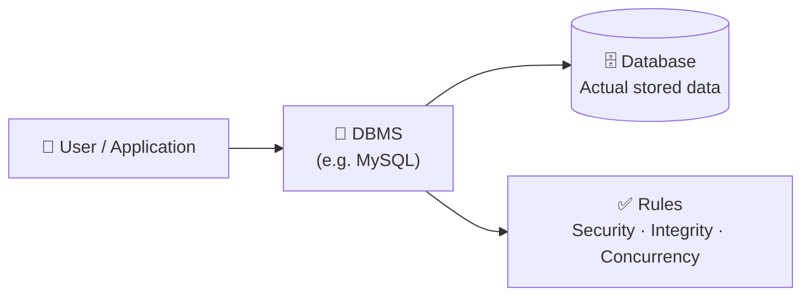
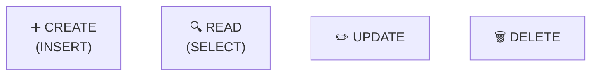
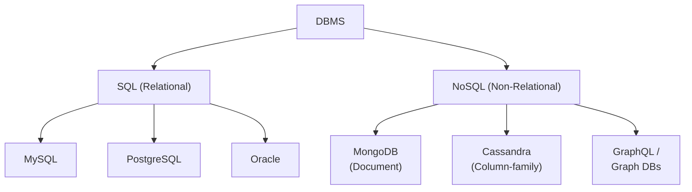
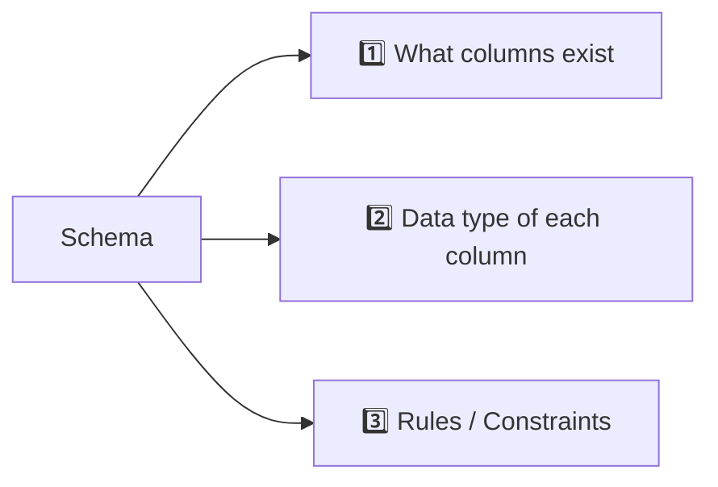
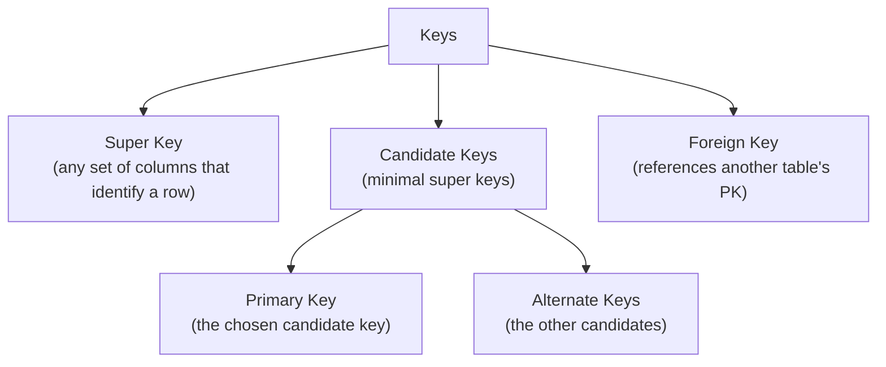

# Class 1 — Introduction to DBMS

> **Big picture:** Real-world data cannot live in flat files (CSV, Excel). We need a system that can store, share, search, and protect data while many users read and write it at the same time. That system is a **Database Management System (DBMS)**.

---

## 1. Why Not Just Use Files?

Imagine a college trying to manage the records of 10,000 students inside a single Excel file.

| Problem                  | What Goes Wrong                                                                                         |
| ------------------------ | ------------------------------------------------------------------------------------------------------- |
| **Scale**                | A single sheet cannot hold all data — it becomes slow, corruptible, and unreadable.                     |
| **Concurrency**          | If two people open and edit the file at the same time, one person's changes overwrite the other's.      |
| **No integrity rules**   | Nothing stops someone from typing `"twenty"` into an `age` column.                                      |
| **No security**          | Anyone with the file has *all* the data — no row-level or user-level access.                            |
| **No relationships**     | A student's marks, fees, and attendance end up in 3 disconnected files with no way to join them safely. |
| **No backup / recovery** | One accidental save can wipe years of records.                                                          |

> **Conclusion:** We need a **structured data management system** → a **Database** managed by a **DBMS**.

---

## 2. What Is a Database vs a DBMS?



- **Database** → the organised collection of data itself.
- **DBMS** → the software that lets us *talk to* the database (read, write, update, delete, enforce rules).
- **MySQL** → one specific DBMS. Others: PostgreSQL, Oracle, SQL Server, SQLite.

> In this course we focus **only on SQL (relational) databases**.

---

## 3. Memory Hierarchy

Before understanding *where* a database lives, we need to understand the memory layers of a computer.

```
                   ▲  FASTEST · SMALLEST · MOST EXPENSIVE
                   │
        ┌──────────┴──────────┐
        │      REGISTERS      │  ← CPU instructions being executed right now
        ├─────────────────────┤
        │        CACHE        │  ← L1 / L2 / L3, very hot data
        ├─────────────────────┤
        │         RAM         │  ← DBMS + running applications live here
        ├─────────────────────┤
        │      HARD DISK      │  ← The database itself (persistent storage)
        └─────────────────────┘
                   │
                   ▼  SLOWEST · LARGEST · CHEAPEST
```

| Layer               | Speed          | Volatility                                | Role                                                                               |
| ------------------- | -------------- | ----------------------------------------- | ---------------------------------------------------------------------------------- |
| **Registers**       | Extremely fast | Volatile                                  | Hold the current instructions the CPU is executing.                                |
| **Cache**           | Very fast      | Volatile                                  | Short-term staging for CPU-bound data.                                             |
| **RAM**             | Fast           | Volatile (lost on shutdown)               | The **DBMS and applications run here**.                                            |
| **Hard Disk / SSD** | Slowest        | **Non-volatile** (data survives shutdown) | The **actual database files live here**. Also stores programs, videos, games, etc. |

### Key Insight
- Data *at rest* lives on the hard disk → survives power loss.
- Data *in use* is pulled into RAM by the DBMS → fast access.
- The DBMS is the bridge: it moves data between disk and RAM efficiently, and manages what can be read/changed.

---

## 4. What Does a DBMS Actually Do?

The four primitive operations — often called **CRUD**:



| Operation  | SQL keyword | Meaning                 |
| ---------- | ----------- | ----------------------- |
| **Create** | `INSERT`    | Add new records         |
| **Read**   | `SELECT`    | Fetch / query records   |
| **Update** | `UPDATE`    | Modify existing records |
| **Delete** | `DELETE`    | Remove records          |

Beyond CRUD, a DBMS also handles: concurrency control, transactions, access control, backup, indexing, and constraint enforcement.

---

## 5. Features of a Good Database

A database must be:

| Feature | Meaning |
|---|---|
| **Searchable** | Find any record quickly, even among millions. |
| **Shared** | Multiple users and applications can access it simultaneously, safely. |
| **Constantly Changing** | Handles continuous inserts, updates, and deletes without corruption. |
| **Organised** | Data follows a defined structure (schema) — not random. |
| **Safe / Secure** | Durable against crashes; protected from unauthorised access. |

---

## 6. Types of DBMS



### SQL (Relational) Databases
- Data is stored in **tables** (rows × columns).
- Structure is **strict** — every row must follow the schema.
- Query language: **SQL** (Structured Query Language).
- Examples: **MySQL, PostgreSQL, Oracle, SQL Server**.

### NoSQL (Non-Relational) Databases
- Data is stored flexibly — as documents, key-value pairs, graphs, or wide columns.
- Structure is **loose** — fields can vary between records.
- Each type has its own query style.
- Examples: **MongoDB** (documents), **Cassandra** (wide-column), **Neo4j** (graph).

> **Quick heuristic:** SQL → when structure and relationships matter. NoSQL → when scale, flexibility, or unstructured data matter.

---

## 7. SQL Databases in Depth

SQL databases are called **relational** because data is organised into **related tables**.

![[Pasted image 20260424114149.png]]

### Anatomy of a Table

```
                 ┌──── Attributes / Columns ────┐
                 ▼                               ▼
              ┌────────┬──────────┬──────────┬────────┐
              │  id    │  name    │  branch  │  cgpa  │   ← Schema (column names + types)
              ├────────┼──────────┼──────────┼────────┤
              │  1     │  Aarav   │  CSE     │  8.9   │
  Records →   │  2     │  Priya   │  ECE     │  9.2   │
  (Rows)      │  3     │  Rohan   │  ME      │  7.5   │
              │  4     │  Sneha   │  CSE     │  9.5   │
              └────────┴──────────┴──────────┴────────┘

              ▲
              │ The entire table represents the ENTITY "Student"
              │ (not any single student)
```

| Term                     | Meaning                                                                                                                                     |
| ------------------------ | ------------------------------------------------------------------------------------------------------------------------------------------- |
| **Entity**               | A *thing* that exists and whose data we want to store. The **table** represents the entity (e.g., `Student`, `Course`, `Book`).             |
| **Attribute / Column**   | A property of the entity. Each column is **homogeneous** — every value in it is of the same **data type** (e.g., `INT`, `VARCHAR`, `DATE`). |
| **Record / Row / Tuple** | One instance of the entity — one specific student, one specific book.                                                                       |
| **Field**                | The single cell where a row meets a column.                                                                                                 |

> **Important:** The *table as a whole* models the entity — a single row is just one record of that entity, not the entity itself.

---

## 8. Database Schema

The **schema** is the **blueprint / structure** of a table — defined *before* any data goes in.

### A Schema Defines Three Things



### 1. Columns
Which attributes the entity has (e.g., `id`, `name`, `email`, `dob`).

### 2. Data Types
Every column must declare what kind of data it holds.

| Category        | Examples                                |
| --------------- | --------------------------------------- |
| **Numeric**     | `INT`, `BIGINT`, `FLOAT`, `DECIMAL`     |
| **Text**        | `CHAR(n)`, `VARCHAR(n)`, `TEXT`         |
| **Date / Time** | `DATE`, `TIME`, `DATETIME`, `TIMESTAMP` |
| **Boolean**     | `BOOLEAN`                               |

### 3. Rules (Constraints)
Rules the DBMS enforces automatically:

| Constraint      | Effect                                                     |
| --------------- | ---------------------------------------------------------- |
| **NOT NULL**    | The column must always have a value (cannot be blank).     |
| **UNIQUE**      | No two rows may share the same value in this column.       |
| **PRIMARY KEY** | NOT NULL + UNIQUE — uniquely identifies each row.          |
| **DEFAULT**     | Fallback value if none is provided.                        |
| **CHECK**       | Custom condition (e.g., `age > 0`).                        |
| **FOREIGN KEY** | Value must exist in another table — links tables together. |

---

## 9. Keys

A **key** is one or more columns that can **uniquely identify each record** in a table.



### Primary Key — Rules
1. **Unique** — no two rows can have the same value.
2. **Not Null** — cannot be missing.
3. **Stable** — should not change over time.
4. Every table should have **exactly one** primary key.

### Example

| id (PK) | name  | email (UNIQUE) | branch |
| ------- | ----- | -------------- | ------ |
| 1       | Aarav | aarav@uni.edu  | CSE    |
| 2       | Priya | priya@uni.edu  | ECE    |
| 3       | Rohan | rohan@uni.edu  | ME     |

- `id` is the **primary key** — guaranteed unique + not null.
- `email` is a **candidate / alternate key** — also unique, but we chose `id` as primary.
- `name` is **not a key** — two students could share the same name.

---


## Quick Recap — One-Liner Per Concept

- **Files fail** → no concurrency, no integrity, no sharing.
- **DBMS** = the software; **Database** = the data it manages.
- **Hard disk** stores data permanently; **RAM** runs the DBMS.
- **CRUD** = Create, Read, Update, Delete.
- **SQL DBs** store data in tables with strict schema; **NoSQL** is flexible.
- **Table = Entity**, **Column = Attribute**, **Row = Record**.
- **Schema** = columns + data types + constraints.
- **Primary Key** = unique + not null → identifies every row.
