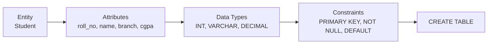
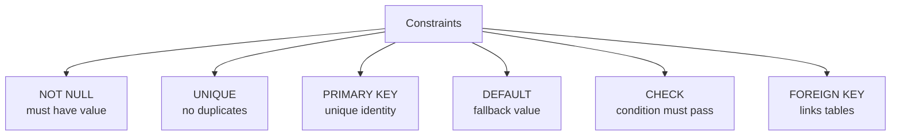
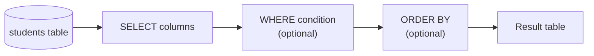
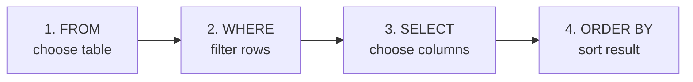

# Class 2 — SQL Basics: Creating Tables & Reading Data

> **Big picture:** SQL is the language we use to talk to a relational DBMS. In Class 1 we learned that a table has a **schema**: columns, data types, and rules. In this class we turn that idea into actual SQL: create a table, insert rows, and select exactly the records we want.

---

## 1. From Schema to SQL

A table is not created randomly. We first decide the **entity**, its **attributes**, the **type** of each attribute, and the **rules** the DBMS must enforce.



Example entity: **Student**

| Attribute | Meaning                    | SQL type              | Rule              |
| --------- | -------------------------- | --------------------- | ----------------- |
| `roll_no` | unique student roll number | `INT`                 | `PRIMARY KEY`     |
| `name`    | student name               | `VARCHAR(50)`         | `NOT NULL`        |
| `branch`  | department / branch        | `VARCHAR(10)`         | `NOT NULL`        |
| `cgpa`    | current CGPA               | `DECIMAL(4,2)`        | default allowed   |
| `batch`   | batch section              | `ENUM('A', 'B', 'C')` | restricted values |

> **Key idea:** SQL is just the formal way of writing this blueprint so that the DBMS can enforce it.

---

## 2. SQL Data Types

Every column must have a data type. The type tells the DBMS what kind of value can be stored and how much space to reserve.

### 2.1 String / Text Types

| Type                | Meaning                                                            | Example                                   |
| ------------------- | ------------------------------------------------------------------ | ----------------------------------------- |
| `CHAR(size)`        | Fixed-length string. Pads unused space.                            | `CHAR(2)` for state codes like `UP`, `DL` |
| `VARCHAR(size)`     | Variable-length string up to `size`. Most common for names/emails. | `VARCHAR(50)`                             |
| `TEXT`              | Long text data.                                                    | descriptions, comments                    |
| `BINARY(size)`      | Fixed-length binary bytes.                                         | raw binary values                         |
| `ENUM(v1, v2, ...)` | Value must be one from a fixed list.                               | `ENUM('A', 'B', 'C')`                     |

```sql
batch ENUM('A', 'B', 'C')
```

If a coaching platform has only batches `A`, `B`, and `C`, `ENUM` prevents invalid values like `D` or `Morning Batch` from entering that column.

### 2.2 Numeric Types

| Type               | Meaning                                                                  |
| ------------------ | ------------------------------------------------------------------------ |
| `BIT(size)`        | Bit values. Size is usually 1 to 64.                                     |
| `TINYINT`          | Very small integer, usually `-128` to `127`.                             |
| `SMALLINT`         | Small integer.                                                           |
| `INT` / `INTEGER`  | Normal integer.                                                          |
| `BIGINT`           | Very large integer.                                                      |
| `DECIMAL(size, d)` | Exact decimal number. `size` = total digits, `d` = digits after decimal. |
| `FLOAT` / `DOUBLE` | Approximate decimal numbers. Useful for scientific values, not money.    |
| `BOOL` / `BOOLEAN` | In MySQL, `0` means false and non-zero means true.                       |

Example:

```sql
cgpa DECIMAL(4,2)
```

This allows values like `9.45`, `8.70`, `10.00` because there are **4 total digits** and **2 digits after the decimal point**.

> **Important:** Use `DECIMAL` when exactness matters. `FLOAT` and `DOUBLE` can introduce small rounding errors.

### 2.3 Date and Time Types

| Type | Format | Example |
|---|---|---|
| `DATE` | `YYYY-MM-DD` | `'2026-04-28'` |
| `TIME` | `HH:MM:SS` | `'14:30:00'` |
| `DATETIME` | `YYYY-MM-DD HH:MM:SS` | `'2026-04-28 14:30:00'` |
| `TIMESTAMP` | date + time, often timezone-aware internally | login time, update time |
| `YEAR` | year value | `2026` |

---

## 3. Constraints — Rules on Columns

Constraints are rules the DBMS checks automatically.

| Constraint    | Meaning                                                 |
| ------------- | ------------------------------------------------------- |
| `NOT NULL`    | Value cannot be blank.                                  |
| `UNIQUE`      | No two rows can have the same value in this column.     |
| `PRIMARY KEY` | Unique + not null; identifies each row.                 |
| `DEFAULT`     | Uses a fallback value if no value is provided.          |
| `CHECK`       | Custom condition, e.g. `cgpa <= 10`.                    |
| `FOREIGN KEY` | Value must exist in another table. Used to link tables. |



> **Class 1 connection:** These are the "rules" part of the schema.

---

## 4. Creating a Table — `CREATE TABLE`

Basic syntax:

```sql
CREATE TABLE table_name (
    column_1 data_type constraint,
    column_2 data_type constraint,
    column_3 data_type constraint
);
```

Example:

```sql
CREATE TABLE students (
    roll_no INT PRIMARY KEY,
    name VARCHAR(50) NOT NULL,
    branch VARCHAR(10) NOT NULL,
    cgpa DECIMAL(4,2) DEFAULT 0.00,
    batch ENUM('A', 'B', 'C') NOT NULL,
    admission_date DATE
);
```

This creates the table structure:

| Column | Type | Constraint |
|---|---|---|
| `roll_no` | `INT` | `PRIMARY KEY` |
| `name` | `VARCHAR(50)` | `NOT NULL` |
| `branch` | `VARCHAR(10)` | `NOT NULL` |
| `cgpa` | `DECIMAL(4,2)` | `DEFAULT 0.00` |
| `batch` | `ENUM('A','B','C')` | `NOT NULL` |
| `admission_date` | `DATE` | optional |

> **Important:** Creating a table creates only the empty structure. It does not insert data.

---

## 5. Inserting Data — `INSERT`

`INSERT` adds new rows into a table.

### 5.1 Insert All Columns

```sql
INSERT INTO students
VALUES (101, 'Aarav', 'CSE', 8.90, 'A', '2026-04-01');
```

This works only when values are given in the exact same order as the table columns.

### 5.2 Insert Selected Columns

```sql
INSERT INTO students (roll_no, name, branch, batch, admission_date)
VALUES (102, 'Priya', 'ECE', 'B', '2026-04-02');
```

Here `cgpa` is not provided, so MySQL uses the default value `0.00`.

### 5.3 Insert Multiple Rows

```sql
INSERT INTO students (roll_no, name, branch, cgpa, batch, admission_date)
VALUES
    (103, 'Rohan', 'ME', 7.50, 'A', '2026-04-03'),
    (104, 'Sneha', 'CSE', 9.50, 'C', '2026-04-04'),
    (105, 'Kabir', 'CSE', 8.20, 'B', '2026-04-05');
```

After inserting, the table looks like this:

| roll_no | name | branch | cgpa | batch | admission_date |
|---:|---|---|---:|---|---|
| 101 | Aarav | CSE | 8.90 | A | 2026-04-01 |
| 102 | Priya | ECE | 0.00 | B | 2026-04-02 |
| 103 | Rohan | ME | 7.50 | A | 2026-04-03 |
| 104 | Sneha | CSE | 9.50 | C | 2026-04-04 |
| 105 | Kabir | CSE | 8.20 | B | 2026-04-05 |

---

## 6. Reading Data — `SELECT`
 data from a table.



### 6.1 Select All Columns

```sql
SELECT *
`SELECT` is used to fetch
FROM students;
```

`*` means "all columns".

### 6.2 Select Specific Columns

```sql
SELECT name, branch, cgpa
FROM students;
```

Result:

| name  | branch | cgpa |
| ----- | ------ | ---: |
| Aarav | CSE    | 8.90 |
| Priya | ECE    | 0.00 |
| Rohan | ME     | 7.50 |
| Sneha | CSE    | 9.50 |
| Kabir | CSE    | 8.20 |

> **Good habit:** Select only the columns you need. `SELECT *` is fine while learning, but production queries should usually be specific.

---

## 7. Filtering Rows — `WHERE`

`WHERE` selects only the rows that satisfy a condition.

```sql
SELECT column_names
FROM table_name
WHERE condition;
```

Example:

```sql
SELECT roll_no, name, cgpa
FROM students
WHERE branch = 'CSE';
```

Result:

| roll_no | name | cgpa |
|---:|---|---:|
| 101 | Aarav | 8.90 |
| 104 | Sneha | 9.50 |
| 105 | Kabir | 8.20 |

### 7.1 Comparison Operators

| Operator     | Meaning               | Example           |
| ------------ | --------------------- | ----------------- |
| `=`          | equal to              | `branch = 'CSE'`  |
| `<>` or `!=` | not equal to          | `branch != 'CSE'` |
| `>`          | greater than          | `cgpa > 8`        |
| `<`          | less than             | `cgpa < 8`        |
| `>=`         | greater than or equal | `cgpa >= 9`       |
| `<=`         | less than or equal    | `cgpa <= 7.5`     |

```sql
SELECT name, cgpa
FROM students
WHERE cgpa >= 8.5;
```

### 7.2 Logical Operators

| Operator | Meaning |
|---|---|
| `AND` | both conditions must be true |
| `OR` | at least one condition must be true |
| `NOT` | reverses the condition |

```sql
SELECT name, branch, cgpa
FROM students
WHERE branch = 'CSE' AND cgpa > 8.5;
```

Result:

| name | branch | cgpa |
|---|---|---:|
| Aarav | CSE | 8.90 |
| Sneha | CSE | 9.50 |

---

## 8. Useful `WHERE` Patterns

### 8.1 `BETWEEN`

```sql
SELECT name, cgpa
FROM students
WHERE cgpa BETWEEN 8.0 AND 9.0;
```

`BETWEEN` includes both boundary values.

### 8.2 `IN`

```sql
SELECT name, branch
FROM students
WHERE branch IN ('CSE', 'ECE');
```

This is cleaner than writing:

```sql
WHERE branch = 'CSE' OR branch = 'ECE'
```

### 8.3 `LIKE`

`LIKE` is used for pattern matching in strings.

| Pattern  | Meaning              |
| -------- | -------------------- |
| `'A%'`   | starts with `A`      |
| `'%a'`   | ends with `a`        |
| `'%ar%'` | contains `ar`        |
| `'_a%'`  | second letter is `a` |

```sql
SELECT roll_no, name
FROM students
WHERE name LIKE 'S%';
```

Result:

| roll_no | name |
|---:|---|
| 104 | Sneha |

### 8.4 `IS NULL`

Use `IS NULL` to find missing values.

```sql
SELECT name
FROM students
WHERE admission_date IS NULL;
```

> **Important:** Do not write `admission_date = NULL`. `NULL` means unknown/missing, so SQL uses `IS NULL` and `IS NOT NULL`.

---

## 9. Removing Duplicates — `DISTINCT`

`DISTINCT` returns unique values only.

```sql
SELECT DISTINCT branch
FROM students;
```

Result:

| branch |
|---|
| CSE |
| ECE |
| ME |

Without `DISTINCT`, `CSE` would appear multiple times because multiple students belong to CSE.

---

## 10. Sorting Results — `ORDER BY`

`ORDER BY` sorts the result table.

```sql
SELECT name, cgpa
FROM students
ORDER BY cgpa DESC;
```

| name | cgpa |
|---|---:|
| Sneha | 9.50 |
| Aarav | 8.90 |
| Kabir | 8.20 |
| Rohan | 7.50 |
| Priya | 0.00 |

| Keyword | Meaning |
|---|---|
| `ASC` | ascending order, smallest to largest. Default. |
| `DESC` | descending order, largest to smallest. |

Multiple sort keys:

```sql
SELECT name, branch, cgpa
FROM students
ORDER BY branch ASC, cgpa DESC;
```

This sorts by branch first. If two students have the same branch, it sorts those students by CGPA descending.

---

## 11. SQL Query Execution Order

The written order and the logical execution order are not exactly the same.

Written order:

```sql
SELECT name, cgpa
FROM students
WHERE branch = 'CSE'
ORDER BY cgpa DESC;
```

Logical order:



> **Why this matters:** `WHERE` filters rows before `SELECT` shows columns. So conditions are applied to the table first, then the final output is displayed.

---

## 12. Mini Practice Set

Using the `students` table, write queries for:

1. Show all students from batch `A`.
2. Show names and CGPAs of students with `cgpa > 8`.
3. Show all branches without duplicates.
4. Show CSE students sorted by highest CGPA first.
5. Show students whose name starts with `A`.

Answers:

```sql
SELECT * FROM students WHERE batch = 'A';

SELECT name, cgpa FROM students WHERE cgpa > 8;

SELECT DISTINCT branch FROM students;

SELECT name, cgpa FROM students
WHERE branch = 'CSE'
ORDER BY cgpa DESC;

SELECT * FROM students WHERE name LIKE 'A%';
```

---

## Quick Recap — One-Liner Per Concept

- **Data type** = what kind of value a column can store.
- **Constraint** = rule the DBMS enforces automatically.
- **`CREATE TABLE`** = define schema.
- **`INSERT`** = add rows.
- **`SELECT`** = read rows.
- **`WHERE`** = filter rows using conditions.
- **`DISTINCT`** = remove duplicate output values.
- **`ORDER BY`** = sort result rows.
- **`DESC`** = descending order.
- **Good SQL habit** = preview exactly what you are selecting before modifying data.
