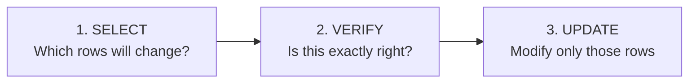
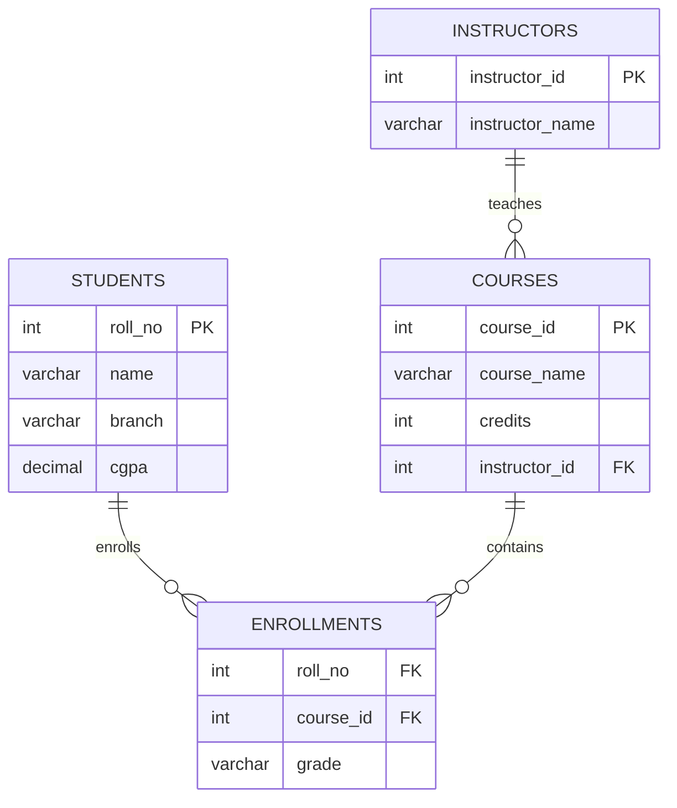
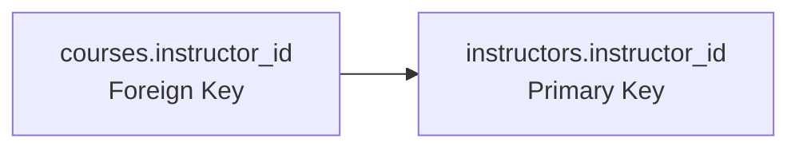
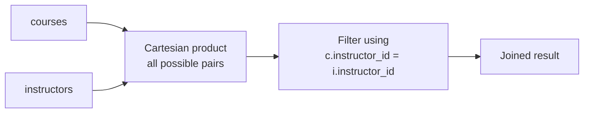
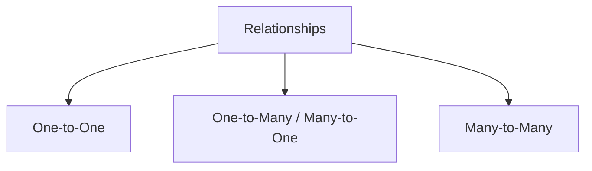
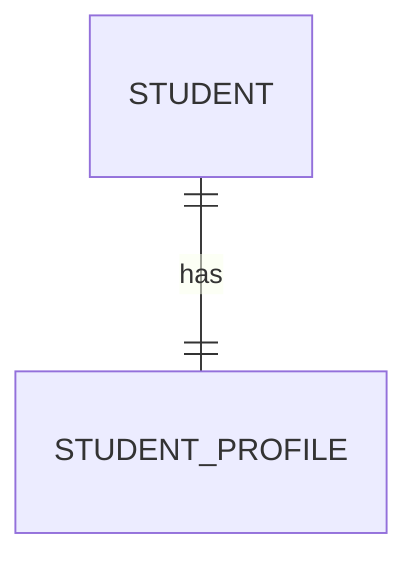
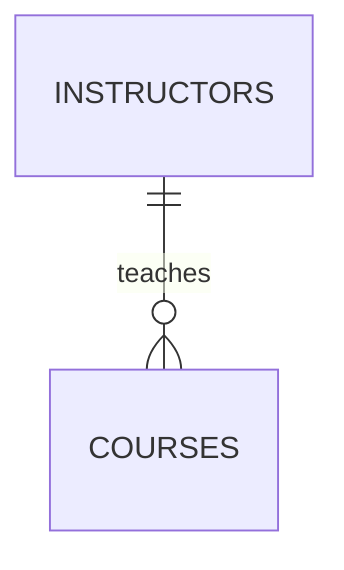
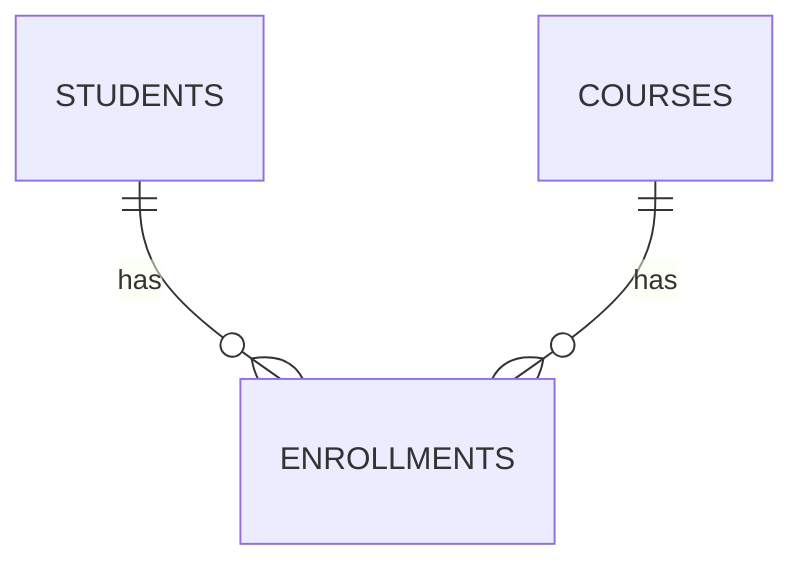

# Class 3 — Updating Data & Joining Tables

> **Big picture:** A DBMS is useful because data is not frozen. Real data changes: marks are updated, courses are assigned, students enroll, instructors change. SQL gives us `UPDATE` for modifying existing rows and `JOIN` for reading connected data from multiple related tables.

---

## 1. CRUD Recap

The four primitive operations in a database are called **CRUD**.


| CRUD operation | SQL keyword | Meaning |
|---|---|---|
| **Create** | `INSERT` | Add new rows |
| **Read** | `SELECT` | Fetch rows |
| **Update** | `UPDATE` | Modify existing rows |
| **Delete** | `DELETE` | Remove rows |

Class 2 covered `CREATE TABLE`, `INSERT`, and `SELECT`. This class focuses on the dangerous one: **`UPDATE`**, and the powerful one: **`JOIN`**.

---

## 2. Updating Data — `UPDATE`

`UPDATE` modifies one or more columns for selected rows.

Basic syntax:

```sql
UPDATE table_name
SET column_1 = value_1,
    column_2 = value_2
WHERE condition;
```

Example table:

| roll_no | name | branch | cgpa | batch |
|---:|---|---|---:|---|
| 101 | Aarav | CSE | 8.90 | A |
| 102 | Priya | ECE | 0.00 | B |
| 103 | Rohan | ME | 7.50 | A |
| 104 | Sneha | CSE | 9.50 | C |
| 105 | Kabir | CSE | 8.20 | B |

Suppose Priya's CGPA has now been calculated as `8.75`.

```sql
UPDATE students
SET cgpa = 8.75
WHERE roll_no = 102;
```

After update:

| roll_no | name | branch | cgpa | batch |
|---:|---|---|---:|---|
| 102 | Priya | ECE | 8.75 | B |

> **Important:** `UPDATE` changes existing rows. It does not create new rows.

---

## 3. The Safe Update Workflow

Updating has three mental steps:



### Step 1 — Preview with `SELECT`

```sql
SELECT *
FROM students
WHERE roll_no = 102;
```

### Step 2 — Verify the condition

Ask:

- Does this return exactly the rows I want?
- Is the `WHERE` clause using a stable identifier like primary key?
- Am I accidentally selecting a whole branch, batch, or table?

### Step 3 — Run the `UPDATE`

```sql
UPDATE students
SET cgpa = 8.75
WHERE roll_no = 102;
```

> [!warning] Never casually run an update without `WHERE`
> 
> ```sql
> UPDATE students
> SET cgpa = 0.00;
> ```
> This updates **every row** in the table.

---

## 4. Why Updates Are Risky

| Risk | What can go wrong |
|---|---|
| **Unintended bulk update** | Missing or weak `WHERE` changes thousands of rows. |
| **Data corruption** | Wrong value gets written into correct rows. |
| **Loss of historical information** | Old value is overwritten unless backups/audit tables exist. |
| **Wrong condition** | `branch = 'CSE'` might update all CSE students instead of one student. |

### Good Conditions vs Bad Conditions

| Query | Risk |
|---|---|
| `WHERE roll_no = 102` | Good. Primary key identifies one row. |
| `WHERE name = 'Priya'` | Risky. Names may repeat. |
| `WHERE branch = 'CSE'` | Bulk update. Correct only if every CSE row should change. |
| no `WHERE` | Updates the entire table. Dangerous. |

---

## 5. Updating Multiple Columns

You can update multiple attributes in the same query.

```sql
UPDATE students
SET branch = 'CSE',
    batch = 'A',
    cgpa = 8.95
WHERE roll_no = 102;
```

This changes exactly one row because `roll_no` is the primary key.

> **Rule of thumb:** The more columns you update, the more important the preview `SELECT` becomes.

---

## 6. Why We Need Multiple Tables

Before learning joins, ask: why not store everything in one giant table?

Imagine this table:

| student_name | roll_no | course_name | credits | instructor_name | grade |
|---|---:|---|---:|---|---|
| Aarav | 101 | DBMS | 4 | Dr. Mehra | A |
| Aarav | 101 | OSCon | 4 | Dr. Rao | B+ |
| Sneha | 104 | DBMS | 4 | Dr. Mehra | A+ |
| Kabir | 105 | DBMS | 4 | Dr. Mehra | B |

This looks convenient, but it causes problems.

| Problem | Example |
|---|---|
| **Update anomaly** | If `Dr. Mehra` changes name/title, we must update many rows. |
| **Delete anomaly** | If the last DBMS enrollment is deleted, we may lose the fact that DBMS exists. |
| **Insert anomaly** | Cannot add a new course until at least one student enrolls. |
| **Wasted space** | Course and instructor details repeat again and again. |

> **Conclusion:** Split data into related tables, then use joins to read it back together.

---

## 7. Sample College Database

We will use four tables.



### `students`

| roll_no | name | branch | cgpa |
|---:|---|---|---:|
| 101 | Aarav | CSE | 8.90 |
| 102 | Priya | ECE | 8.75 |
| 103 | Rohan | ME | 7.50 |
| 104 | Sneha | CSE | 9.50 |
| 105 | Kabir | CSE | 8.20 |

### `instructors`

| instructor_id | instructor_name |
|---:|---|
| 1 | Dr. Mehra |
| 2 | Dr. Rao |
| 3 | Dr. Iyer |

### `courses`

| course_id | course_name | credits | instructor_id |
|---:|---|---:|---:|
| 201 | DBMS | 4 | 1 |
| 202 | OSCon | 4 | 2 |
| 203 | Networks | 3 | 3 |
| 204 | Compiler Design | 4 | NULL |

### `enrollments`

| roll_no | course_id | grade |
|---:|---:|---|
| 101 | 201 | A |
| 101 | 202 | B+ |
| 102 | 202 | A |
| 104 | 201 | A+ |

---

## 8. Foreign Key — The Link Between Tables

A **foreign key** is a column in one table that refers to the primary key of another table.



Example:

| course_id | course_name | instructor_id |
|---:|---|---:|
| 201 | DBMS | 1 |

The `1` in `courses.instructor_id` points to:

| instructor_id | instructor_name |
|---:|---|
| 1 | Dr. Mehra |

So DBMS is taught by Dr. Mehra.

---

## 9. What Is a Join?

> **Definition:** A join combines rows from two or more tables based on a matching condition.

Basic syntax:

```sql
SELECT columns
FROM table_1
JOIN table_2
ON table_1.common_column = table_2.common_column;
```

Example:

```sql
SELECT course_name, credits, instructor_name
FROM courses c
JOIN instructors i
ON c.instructor_id = i.instructor_id;
```

Result:

| course_name | credits | instructor_name |
|---|---:|---|
| DBMS | 4 | Dr. Mehra |
| OSCon | 4 | Dr. Rao |
| Networks | 3 | Dr. Iyer |

`Compiler Design` is missing because its `instructor_id` is `NULL`, so it does not match any instructor.

> `c` and `i` are table aliases. They make queries shorter: `courses c` means "refer to `courses` as `c` in this query."

---

## 10. How a Join Works Conceptually

The formal idea:

1. Form the Cartesian product of the tables.
2. Keep only the row combinations that satisfy the `ON` condition.



> **Real DBMS note:** MySQL does not actually build the full Cartesian product in a naive way for large tables. Query optimizers use indexes, join algorithms, and cost estimates to avoid unnecessary work. But the Cartesian-product-then-filter model is useful for understanding the logic.

---

## 11. Types of Joins

Assume two tables:

```
LEFT table                         RIGHT table
┌──────────────┐                   ┌──────────────┐
│ matching row │◄──── match ────►  │ matching row │
│ left only    │                   │ right only   │
└──────────────┘                   └──────────────┘
```

| Join type | What it returns |
|---|---|
| `INNER JOIN` / `JOIN` | Only matching rows from both tables. |
| `LEFT JOIN` | All rows from the left table, plus matching right rows if they exist. |
| `RIGHT JOIN` | All rows from the right table, plus matching left rows if they exist. |
| `FULL OUTER JOIN` | All rows from both tables, matched where possible. Not directly supported in MySQL. |
| `CROSS JOIN` | Every row from left paired with every row from right. |

---

## 12. `INNER JOIN`

Visual:

```
       Left table          Right table
      ┌─────────┐         ┌─────────┐
      │         │█████████│         │
      │ match   │█████████│ match   │
      │ only    │█████████│ only    │
      └─────────┘         └─────────┘

Only the overlapping/matching part is returned.
```

Query:

```sql
SELECT c.course_name, c.credits, i.instructor_name
FROM courses c
INNER JOIN instructors i
ON c.instructor_id = i.instructor_id;
```

Result:

| course_name | credits | instructor_name |
|---|---:|---|
| DBMS | 4 | Dr. Mehra |
| OSCon | 4 | Dr. Rao |
| Networks | 3 | Dr. Iyer |

`Compiler Design` does not appear because it has no matching instructor.

---

## 13. `LEFT JOIN`

Visual:

```
       Left table          Right table
      ┌─────────┐         ┌─────────┐
      │█████████│█████████│         │
      │█████████│█████████│ match   │
      │█████████│█████████│ only    │
      └─────────┘         └─────────┘

Everything from the left table is returned.
Missing right-side values become NULL.
```

Query:

```sql
SELECT c.course_name, c.credits, i.instructor_name
FROM courses c
LEFT JOIN instructors i
ON c.instructor_id = i.instructor_id;
```

Result:

| course_name | credits | instructor_name |
|---|---:|---|
| DBMS | 4 | Dr. Mehra |
| OSCon | 4 | Dr. Rao |
| Networks | 3 | Dr. Iyer |
| Compiler Design | 4 | NULL |

Use `LEFT JOIN` when the left table is the main table and you do not want to lose its rows.

---

## 14. `RIGHT JOIN`

Visual:

```
       Left table          Right table
      ┌─────────┐         ┌─────────┐
      │         │█████████│█████████│
      │ match   │█████████│█████████│
      │ only    │█████████│█████████│
      └─────────┘         └─────────┘

Everything from the right table is returned.
Missing left-side values become NULL.
```

Query:

```sql
SELECT c.course_name, i.instructor_name
FROM courses c
RIGHT JOIN instructors i
ON c.instructor_id = i.instructor_id;
```

Result with the current data:

| course_name | instructor_name |
|---|---|
| DBMS | Dr. Mehra |
| OSCon | Dr. Rao |
| Networks | Dr. Iyer |

If an instructor had no course, that instructor would still appear, with `course_name = NULL`.

> **Practical tip:** Many developers prefer writing everything as `LEFT JOIN` by swapping table order. It is easier to read one consistent direction.

---

## 15. `FULL OUTER JOIN`

Visual:

```
       Left table          Right table
      ┌─────────┐         ┌─────────┐
      │█████████│█████████│█████████│
      │█████████│█████████│█████████│
      │█████████│█████████│█████████│
      └─────────┘         └─────────┘

Everything from both tables is returned.
Matched rows are combined; unmatched sides become NULL.
```

`FULL OUTER JOIN` is conceptually:

- all rows that match,
- plus left-only rows,
- plus right-only rows.

> **MySQL note:** MySQL does not directly support `FULL OUTER JOIN`. You can simulate it with `LEFT JOIN`, `RIGHT JOIN`, and `UNION`.

```sql
SELECT c.course_name, i.instructor_name
FROM courses c
LEFT JOIN instructors i
ON c.instructor_id = i.instructor_id

UNION

SELECT c.course_name, i.instructor_name
FROM courses c
RIGHT JOIN instructors i
ON c.instructor_id = i.instructor_id;
```

---

## 16. Joining More Than Two Tables

Goal: show each student's course, instructor, and grade.

```sql
SELECT
    s.name AS student_name,
    s.roll_no,
    c.course_name,
    i.instructor_name,
    e.grade
FROM students s
JOIN enrollments e
ON s.roll_no = e.roll_no
JOIN courses c
ON e.course_id = c.course_id
JOIN instructors i
ON c.instructor_id = i.instructor_id;
```

Result:

| student_name | roll_no | course_name | instructor_name | grade |
|---|---:|---|---|---|
| Aarav | 101 | DBMS | Dr. Mehra | A |
| Aarav | 101 | OSCon | Dr. Rao | B+ |
| Priya | 102 | OSCon | Dr. Rao | A |
| Sneha | 104 | DBMS | Dr. Mehra | A+ |


Read the join path like a sentence:

> Student → has enrollments → each enrollment belongs to a course → each course has an instructor.

---

## 17. Types of Relationships

Tables relate to each other in three common ways.



### 17.1 One-to-One

One row in table A matches exactly one row in table B.

Example:

| students | student_profiles |
|---|---|
| one student | one profile |



Use when optional or sensitive details should be separated from the main table.

### 17.2 One-to-Many

One row in table A can match many rows in table B.

Example:



One instructor can teach many courses. Each course has one instructor.

This is implemented by putting the foreign key on the "many" side:

```sql
courses.instructor_id --> instructors.instructor_id
```

### 17.3 Many-to-Many

Many students can take many courses.



We do **not** directly connect `students` and `courses` with repeated columns. We create a **junction table**:

| roll_no | course_id | grade |
|---:|---:|---|
| 101 | 201 | A |
| 101 | 202 | B+ |
| 102 | 202 | A |
| 104 | 201 | A+ |

This table is called `enrollments`.

> **Rule:** Many-to-many relationships are usually implemented using a junction table.

---

## 18. Common Join Mistakes

| Mistake | What happens |
|---|---|
| Forgetting `ON` | You may accidentally create a Cartesian product. |
| Joining wrong columns | Rows combine incorrectly. |
| Using `INNER JOIN` when you need unmatched rows | Missing data disappears from the result. |
| Not qualifying column names | SQL may not know whether `id` means `students.id` or `courses.id`. |
| Putting right-table conditions in `WHERE` after a `LEFT JOIN` | Can accidentally turn it into an inner join. |

Example of ambiguous column names:

```sql
SELECT name, course_name
FROM students
JOIN enrollments
ON roll_no = roll_no;
```

Better:

```sql
SELECT s.name, c.course_name
FROM students s
JOIN enrollments e
ON s.roll_no = e.roll_no
JOIN courses c
ON e.course_id = c.course_id;
```

---

## 19. Mini Practice Set

Using the sample college database:

1. Update Kabir's CGPA to `8.60`.
2. Show all courses with their instructor names.
3. Show all courses even if no instructor is assigned.
4. Show student name, course name, and grade.
5. Show all students, including students who have not enrolled in any course.

Answers:

```sql
UPDATE students
SET cgpa = 8.60
WHERE roll_no = 105;

SELECT c.course_name, i.instructor_name
FROM courses c
JOIN instructors i
ON c.instructor_id = i.instructor_id;

SELECT c.course_name, i.instructor_name
FROM courses c
LEFT JOIN instructors i
ON c.instructor_id = i.instructor_id;

SELECT s.name, c.course_name, e.grade
FROM students s
JOIN enrollments e
ON s.roll_no = e.roll_no
JOIN courses c
ON e.course_id = c.course_id;

SELECT s.name, c.course_name
FROM students s
LEFT JOIN enrollments e
ON s.roll_no = e.roll_no
LEFT JOIN courses c
ON e.course_id = c.course_id;
```

---

## Quick Recap — One-Liner Per Concept

- **`UPDATE`** modifies existing rows.
- **Safe update workflow** = `SELECT` first, verify, then `UPDATE`.
- **Missing `WHERE`** can update the entire table.
- **Foreign key** = reference to a primary key in another table.
- **Join** = combine rows from related tables.
- **`INNER JOIN`** = only matching rows.
- **`LEFT JOIN`** = all left rows + matching right rows.
- **`RIGHT JOIN`** = all right rows + matching left rows.
- **`FULL OUTER JOIN`** = everything from both sides; simulate in MySQL with `UNION`.
- **Many-to-many** = use a junction table.
