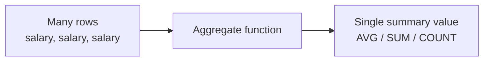
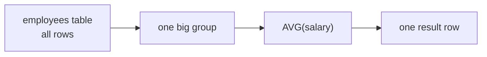
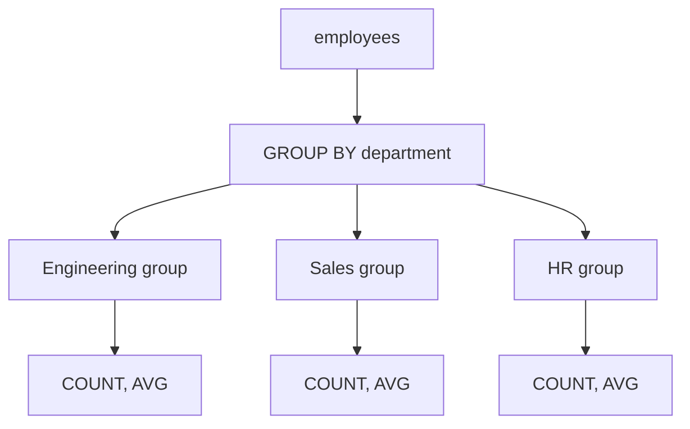
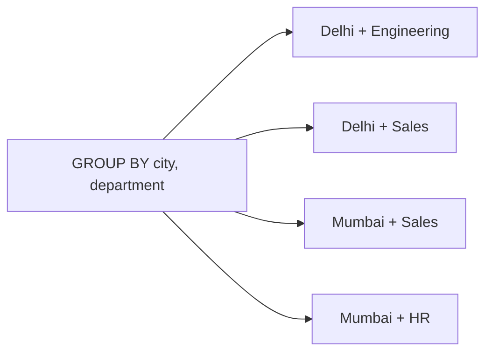
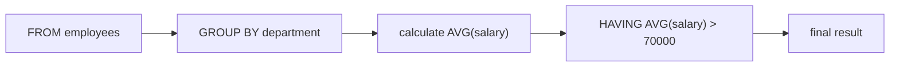

# Class 5 - Aggregate Queries, Grouping & Nested Queries

> **Big picture:** Normal `SELECT` queries show individual rows. Aggregate queries summarize many rows into meaningful information: total employees, average salary, highest marks, department-wise counts, city-wise totals, and so on.

---

## 1. What Are Aggregate Queries?

An **aggregate query** takes multiple rows and produces a summarized value.

Examples:

| Raw data question               | Aggregate answer              |
| ------------------------------- | ----------------------------- |
| What are all employee salaries? | What is the total salary?     |
| What are all marks in DBMS?     | What is the average mark?     |
| Which employees exist?          | How many employees are there? |
| What salaries are stored?       | What is the maximum salary?   |



> **Key idea:** Aggregates transform raw rows into useful summary information.

---

## 2. Sample `employees` Table

The class examples use an `employees` table like this.

| employee_id | employee_name | department  | city      | salary | experience_years |
| ----------: | ------------- | ----------- | --------- | -----: | ---------------: |
|           1 | Aarav         | Engineering | Delhi     |  85000 |                5 |
|           2 | Meera         | Engineering | Delhi     |  76000 |                4 |
|           3 | Rahul         | Sales       | Mumbai    |  52000 |                2 |
|           4 | Nisha         | HR          | Pune      |  61000 |                6 |
|           5 | Kabir         | Engineering | Bengaluru |  92000 |                7 |
|           6 | Priya         | Sales       | Delhi     |  58000 |                3 |
|           7 | Rohan         | Engineering | Delhi     |  68000 |                2 |
|           8 | Sneha         | HR          | Mumbai    |  72000 |                5 |

---

## 3. Common Aggregate Functions

| Function      | Meaning                             | Example use         |
| ------------- | ----------------------------------- | ------------------- |
| `COUNT(*)`    | Counts rows                         | number of employees |
| `SUM(column)` | Adds all values in a numeric column | total salary        |
| `MAX(column)` | Finds the largest value             | highest salary      |
| `MIN(column)` | Finds the smallest value            | lowest salary       |
| `AVG(column)` | Finds the average value             | average salary      |

### 3.1 `COUNT(*)`

```sql
SELECT COUNT(*)
FROM employees;
```

Result:

| COUNT(*) |
|---:|
| 8 |

`COUNT(*)` counts rows. It is the most common way to count records.

### 3.2 `SUM`

```sql
SELECT SUM(salary)
FROM employees;
```

This gives the total salary of all employees.

### 3.3 `MAX` and `MIN`

```sql
SELECT MAX(salary), MIN(salary)
FROM employees;
```

Result:

| MAX(salary) | MIN(salary) |
|---:|---:|
| 92000 | 52000 |

### 3.4 `AVG`

```sql
SELECT AVG(salary)
FROM employees;
```

This gives the average salary across all rows.

> **Important:** Aggregate functions usually ignore `NULL` values, except `COUNT(*)`, which counts the row itself.

---

## 4. Aggregate Query Without Grouping

If there is no `GROUP BY`, the whole table is treated as one group.

```sql
SELECT AVG(salary)
FROM employees;
```

Conceptually:



Result:

| AVG(salary) |
|---:|
| 70500 |

So this query answers:

> What is the average salary of all employees?

---

## 5. `GROUP BY`

`GROUP BY` creates internal groups of rows, then runs aggregate functions inside each group.

```sql
SELECT department, COUNT(*), AVG(salary)
FROM employees
GROUP BY department;
```

This means:

1. Split employees by department.
2. Count rows inside each department.
3. Calculate the average salary inside each department.

Result:

| department | COUNT(*) | AVG(salary) |
|---|---:|---:|
| Engineering | 4 | 80250 |
| Sales | 2 | 55000 |
| HR | 2 | 66500 |



> **Key idea:** `GROUP BY` does not show every individual row. It shows one result row per group.

---

## 6. The Most Important `GROUP BY` Rule

When using `GROUP BY`, every selected column must be either:

1. part of the `GROUP BY`, or
2. inside an aggregate function.

Correct:

```sql
SELECT department, AVG(salary)
FROM employees
GROUP BY department;
```

Why it is correct:

| Selected expression | Allowed because                |
| ------------------- | ------------------------------ |
| `department`        | It is in `GROUP BY department` |
| `AVG(salary)`       | It is an aggregate function    |

Incorrect:

```sql
SELECT employee_name, department, AVG(salary)
FROM employees
GROUP BY department;
```

Why it is wrong:

- There are many employees in each department.
- SQL cannot choose one `employee_name` to represent the whole department group.
- `employee_name` is neither grouped nor aggregated.

> **Rule of thumb:** After grouping, individual row details disappear unless you grouped by them.

---

## 7. Grouping by More Than One Column

You can create smaller groups by grouping on multiple columns.

```sql
SELECT city, department, COUNT(*)
FROM employees
GROUP BY city, department;
```

This creates groups like:

| city      | department  | COUNT(*) |
| --------- | ----------- | -------: |
| Delhi     | Engineering |        3 |
| Delhi     | Sales       |        1 |
| Mumbai    | Sales       |        1 |
| Mumbai    | HR          |        1 |
| Pune      | HR          |        1 |
| Bengaluru | Engineering |        1 |



This answers:

> How many employees are there in each city-department combination?

---

## 8. Filtering Before Grouping: `WHERE`

`WHERE` filters individual rows before grouping happens.

Class query:

```sql
SELECT AVG(salary), department
FROM employees
WHERE experience_years > 3
GROUP BY department;
```

This means:

1. First keep only employees with more than 3 years of experience.
2. Then group those remaining rows by department.
3. Then calculate average salary per department.


> Use `WHERE` when the condition is about individual rows.

Examples of row-level conditions:

| Condition | Why `WHERE` is correct |
|---|---|
| `experience_years > 3` | checks each employee row |
| `city = 'Delhi'` | checks each employee row |
| `department = 'Engineering'` | checks each employee row |
| `salary > 60000` | checks each employee row |

---

## 9. Filtering After Grouping: `HAVING`

`HAVING` filters groups after aggregate values are calculated.

Class query:

```sql
SELECT AVG(salary), department
FROM employees
GROUP BY department
HAVING AVG(salary) > 70000;
```

This means:

1. Group employees by department.
2. Calculate the average salary of each department.
3. Keep only departments whose average salary is greater than `70000`.

Result:

| AVG(salary) | department |
|---:|---|
| 80250 | Engineering |



> Use `HAVING` when the condition is about an aggregate result.

Examples of group-level conditions:

| Condition | Why `HAVING` is correct |
|---|---|
| `AVG(salary) > 70000` | average is calculated per group |
| `COUNT(*) > 2` | count is calculated per group |
| `MAX(marks) > 90` | maximum is calculated per group |
| `SUM(amount) > 100000` | total is calculated per group |

---

## 10. `WHERE` vs `HAVING`

| Feature | `WHERE` | `HAVING` |
|---|---|---|
| Filters | individual rows | grouped results |
| Runs | before `GROUP BY` | after `GROUP BY` |
| Can use aggregate functions? | no | yes |
| Example | `WHERE city = 'Delhi'` | `HAVING COUNT(*) > 5` |

### Example 1 - `WHERE`

```sql
SELECT city, COUNT(*)
FROM employees
WHERE department = 'Engineering'
GROUP BY city;
```

Meaning:

> Count Engineering employees in each city.

Here `department = 'Engineering'` is checked row by row, so it belongs in `WHERE`.

### Example 2 - `HAVING`

```sql
SELECT city, COUNT(*)
FROM employees
GROUP BY city
HAVING COUNT(*) > 2;
```

Meaning:

> Show only cities that have more than 2 employees.

Here `COUNT(*) > 2` is known only after grouping, so it belongs in `HAVING`.

### Example 3 - Using Both Together

Class query:

```sql
SELECT city, COUNT(*)
FROM employees
WHERE department = 'Engineering'
GROUP BY city
HAVING COUNT(*) > 5;
```

Meaning:

1. Keep only Engineering employees.
2. Group those employees by city.
3. Show only cities where the Engineering count is more than 5.

---

## 11. Ordering Grouped Results

You can use `ORDER BY` after grouping and filtering.

Class query:

```sql
SELECT COUNT(*), city, department
FROM employees
GROUP BY city, department
HAVING COUNT(*) > 2
ORDER BY city, COUNT(*) DESC;
```

This means:

1. Group employees by `city` and `department`.
2. Keep only groups with more than 2 employees.
3. Sort by city.
4. If two groups have the same city, sort by count in descending order.

Better with aliases:

```sql
SELECT city, department, COUNT(*) AS employee_count
FROM employees
GROUP BY city, department
HAVING COUNT(*) > 2
ORDER BY city, employee_count DESC;
```

> **Good habit:** Use aliases like `employee_count` or `average_salary` to make aggregate results easier to read.

---

## 12. Logical Execution Order

SQL is written in one order, but logically evaluated in another order.

Written order:

```sql
SELECT city, department, COUNT(*) AS employee_count
FROM employees
WHERE salary > 50000
GROUP BY city, department
HAVING COUNT(*) > 2
ORDER BY city;
```

Logical order:


| Step | What happens |
|---:|---|
| 1 | `FROM` chooses the table. |
| 2 | `WHERE` removes unwanted individual rows. |
| 3 | `GROUP BY` creates groups. |
| 4 | `HAVING` removes unwanted groups. |
| 5 | `SELECT` chooses what to display. |
| 6 | `ORDER BY` sorts the final result. |

This order explains why aggregate functions are not used in `WHERE`: at the `WHERE` stage, groups have not been created yet.

---

## 13. Nested Queries / Subqueries

A **nested query** is a query written inside another query.

It is also called a **subquery**.


Basic structure:

```sql
SELECT column_names
FROM table_name
WHERE column_name operator (
    SELECT column_name
    FROM another_table
    WHERE condition
);
```

> **Key idea:** The inner query produces a value or list of values. The outer query uses that result.

---

## 14. Nested Query Returning One Value

Find employees who earn more than the average salary.

```sql
SELECT employee_name, salary
FROM employees
WHERE salary > (
    SELECT AVG(salary)
    FROM employees
);
```

How it works:

1. Inner query calculates the average salary.
2. Outer query finds employees whose salary is greater than that average.

If average salary is `70500`, the outer query becomes:

```sql
SELECT employee_name, salary
FROM employees
WHERE salary > 70500;
```

Result:

| employee_name | salary |
|---|---:|
| Aarav | 85000 |
| Meera | 76000 |
| Kabir | 92000 |
| Sneha | 72000 |

---

## 15. Nested Query Returning Multiple Values

Find employees who work in departments whose average salary is greater than `70000`.

```sql
SELECT employee_name, department, salary
FROM employees
WHERE department IN (
    SELECT department
    FROM employees
    GROUP BY department
    HAVING AVG(salary) > 70000
);
```

How it works:

1. Inner query finds departments with average salary above `70000`.
2. Outer query shows employees who belong to those departments.

The inner query returns:

| department |
|---|
| Engineering |

So the outer query shows Engineering employees.

> Use `IN` when the subquery may return multiple values.

---

## 16. Important Class Queries

### Query 1

Average salary by department, but only for employees with more than 3 years of experience.

```sql
SELECT AVG(salary), department
FROM employees
WHERE experience_years > 3
GROUP BY department;
```

### Query 2

Departments whose average salary is greater than `70000`.

```sql
SELECT AVG(salary), department
FROM employees
GROUP BY department
HAVING AVG(salary) > 70000;
```

### Query 3

City-department groups having more than 2 employees, sorted by city and count.

```sql
SELECT COUNT(*), city, department
FROM employees
GROUP BY city, department
HAVING COUNT(*) > 2
ORDER BY city, COUNT(*) DESC;
```

### Query 4

Cities with more than 5 Engineering employees.

```sql
SELECT city, COUNT(*)
FROM employees
WHERE department = 'Engineering'
GROUP BY city
HAVING COUNT(*) > 5;
```

---

## 17. Common Mistakes

| Mistake                                 | Problem                                     | Fix                                              |
| --------------------------------------- | ------------------------------------------- | ------------------------------------------------ |
| Writing `COUNT()`                       | In MySQL, use `COUNT(*)` or `COUNT(column)` | `COUNT(*)`                                       |
| Using aggregate functions in `WHERE`    | Groups do not exist yet                     | use `HAVING`                                     |
| Selecting non-grouped columns           | SQL cannot pick one row value for a group   | group it or aggregate it                         |
| Forgetting `GROUP BY`                   | The whole table becomes one group           | add `GROUP BY` when you need per-category output |
| Confusing row filters and group filters | Wrong result or SQL error                   | `WHERE` before grouping, `HAVING` after grouping |

Incorrect:

```sql
SELECT department, employee_name, AVG(salary)
FROM employees
GROUP BY department;
```

Correct:

```sql
SELECT department, AVG(salary)
FROM employees
GROUP BY department;
```

Or, if employee-level detail is needed:

```sql
SELECT department, employee_name, salary
FROM employees;
```

---

## 18. Mini Practice Set

Using the `employees` table, write queries for:

1. Count the total number of employees.
2. Find the average salary of all employees.
3. Find the highest and lowest salary.
4. Show the number of employees in each department.
5. Show the average salary in each city.
6. Show departments where average salary is greater than `65000`.
7. Show cities that have more than 2 employees.
8. Show average salary by department only for employees with more than 3 years of experience.
9. Find employees whose salary is greater than the overall average salary.
10. Find employees who belong to departments with average salary greater than `70000`.

Answers:

```sql
SELECT COUNT(*)
FROM employees;

SELECT AVG(salary)
FROM employees;

SELECT MAX(salary), MIN(salary)
FROM employees;

SELECT department, COUNT(*)
FROM employees
GROUP BY department;

SELECT city, AVG(salary)
FROM employees
GROUP BY city;

SELECT department, AVG(salary)
FROM employees
GROUP BY department
HAVING AVG(salary) > 65000;

SELECT city, COUNT(*)
FROM employees
GROUP BY city
HAVING COUNT(*) > 2;

SELECT department, AVG(salary)
FROM employees
WHERE experience_years > 3
GROUP BY department;

SELECT employee_name, salary
FROM employees
WHERE salary > (
    SELECT AVG(salary)
    FROM employees
);

SELECT employee_name, department, salary
FROM employees
WHERE department IN (
    SELECT department
    FROM employees
    GROUP BY department
    HAVING AVG(salary) > 70000
);
```

---

## Quick Recap - One-Liner Per Concept

- **Aggregate function** = summarizes multiple rows into one value.
- **`COUNT(*)`** = counts rows.
- **`SUM(column)`** = adds numeric values.
- **`MAX(column)`** = largest value.
- **`MIN(column)`** = smallest value.
- **`AVG(column)`** = average value.
- **`GROUP BY`** = creates groups before aggregation.
- **Grouped query rule** = selected columns must be grouped or aggregated.
- **`WHERE`** = filters individual rows before grouping.
- **`HAVING`** = filters groups after aggregation.
- **`ORDER BY`** = sorts the final result.
- **Nested query** = query inside another query.
- **`IN` with subquery** = useful when the inner query returns multiple values.
