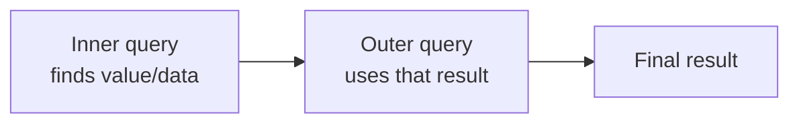
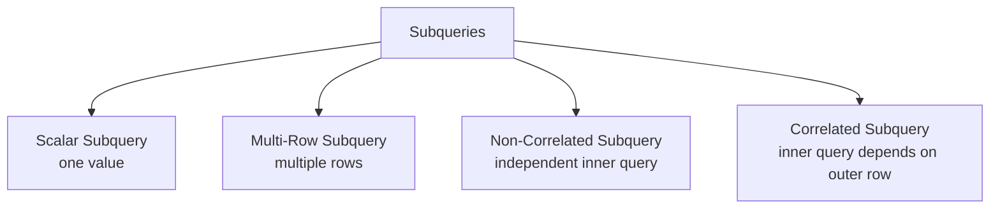
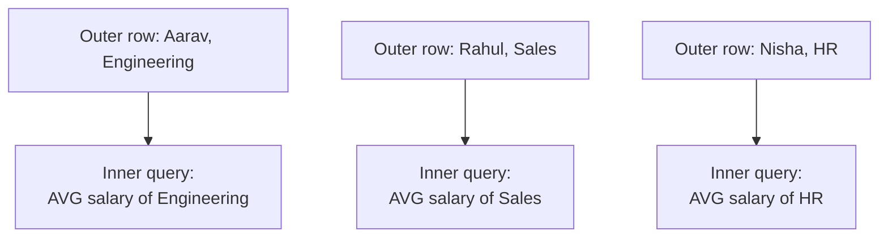

# Class 6 - Subqueries, Nested Queries & ALTER TABLE

> **Big picture:** A subquery lets one SQL query use the result of another SQL query. This is useful when the value you need is not fixed, but must be calculated from the database itself, such as the average salary, departments in a city, or each department's average salary.

---

## 1. What Is a Subquery?

A **subquery** is a query written inside another query.

It is also called a **nested query**.



Basic structure:

```sql
SELECT column_names
FROM table_name
WHERE column_name operator (
    SELECT column_name
    FROM another_table
    WHERE condition
);
```

The inner query runs to produce a result. The outer query then uses that result.

Example:

```sql
SELECT name, salary
FROM employees
WHERE salary > (
    SELECT AVG(salary)
    FROM employees
);
```

This means:

1. First calculate the average employee salary.
2. Then show employees whose salary is greater than that average.

> **Key idea:** A subquery can be thought of as asking the database to calculate a value for you, then using that value in the main query.

---

## 2. Sample `employees` Table

The examples use this table.

| employee_id | name   | department  | city      | salary | experience_years |
| ----------: | ------ | ----------- | --------- | -----: | ---------------: |
|           1 | Aarav  | Engineering | Delhi     |  85000 |                5 |
|           2 | Meera  | Engineering | Delhi     |  76000 |                4 |
|           3 | Rahul  | Sales       | Mumbai    |  52000 |                2 |
|           4 | Nisha  | HR          | Pune      |  61000 |                6 |
|           5 | Kabir  | Engineering | Bengaluru |  92000 |                7 |
|           6 | Priya  | Sales       | Delhi     |  58000 |                3 |
|           7 | Rohan  | Engineering | Delhi     |  68000 |                2 |
|           8 | Sneha  | HR          | Mumbai    |  72000 |                5 |

---

## 3. Why Use a Subquery?

Without subqueries, we often have to manually calculate a value first, then write another query.

Example question:

> Find employees whose salary is greater than the average salary.

Manual method:

```sql
SELECT AVG(salary)
FROM employees;
```

Suppose this returns `70500`.

Then:

```sql
SELECT name, salary
FROM employees
WHERE salary > 70500;
```

Subquery method:

```sql
SELECT name, salary
FROM employees
WHERE salary > (
    SELECT AVG(salary)
    FROM employees
);
```

Now the database calculates the average automatically.

| Manual value | Subquery |
|---|---|
| You calculate first, then use the value | SQL calculates and uses it in one query |
| Value may become outdated if table changes | Always uses current table data |
| Two separate steps | One complete query |

---

## 4. Types of Subqueries



The same subquery can be described in two ways:

| Classification | Based on |
|---|---|
| Scalar vs multi-row | How many values the subquery returns |
| Correlated vs non-correlated | Whether the subquery depends on the outer query |

---

## 5. Scalar Subquery

A **scalar subquery** returns exactly one value: one row and one column.

Example:

```sql
SELECT AVG(salary)
FROM employees;
```

This returns one value:

| AVG(salary) |
|---:|
| 70500 |

So it can be used with normal comparison operators:

```sql
SELECT name, salary
FROM employees
WHERE salary > (
    SELECT AVG(salary)
    FROM employees
);
```

### Operators Used With Scalar Subqueries

Because the result is one value, we can use:

| Operator | Meaning |
|---|---|
| `=` | equal to |
| `>` | greater than |
| `<` | less than |
| `>=` | greater than or equal to |
| `<=` | less than or equal to |
| `<>` / `!=` | not equal to |

Example:

```sql
SELECT name, salary
FROM employees
WHERE salary = (
    SELECT MAX(salary)
    FROM employees
);
```

This finds the employee with the highest salary.

Result:

| name  | salary |
| ----- | -----: |
| Kabir |  92000 |

> **Important:** Scalar subqueries are safe with mathematical comparison operators only because they return one value.

---

## 6. Multi-Row Subquery

A **multi-row subquery** returns multiple values.

Example:

```sql
SELECT department
FROM employees
WHERE city = 'Bengaluru';
```

This could return:

| department |
|---|
| Engineering |

If several departments exist in Bengaluru, it could return multiple rows.

To use multiple values in the outer query, use operators like `IN`, `ANY`, or `ALL`.

Most common:

```sql
SELECT name, department, city
FROM employees
WHERE department IN (
    SELECT department
    FROM employees
    WHERE city = 'Bengaluru'
);
```

This means:

1. Inner query finds departments that have employees in Bengaluru.
2. Outer query finds all employees who belong to those departments.

> **Use `IN` when the subquery may return more than one value.**

---

## 7. Scalar vs Multi-Row: The Operator Rule

This is a common source of errors.

Correct scalar usage:

```sql
SELECT name, salary
FROM employees
WHERE salary > (
    SELECT AVG(salary)
    FROM employees
);
```

Why it works:

- `AVG(salary)` returns one value.
- `>` expects one value.

Incorrect multi-row usage:

```sql
SELECT name, department
FROM employees
WHERE department = (
    SELECT department
    FROM employees
    WHERE city = 'Delhi'
);
```

Why it can fail:

- The inner query may return multiple departments.
- `=` expects exactly one value.

Correct version:

```sql
SELECT name, department
FROM employees
WHERE department IN (
    SELECT department
    FROM employees
    WHERE city = 'Delhi'
);
```

| If subquery returns | Use |
|---|---|
| One value | `=`, `<`, `>`, `<=`, `>=`, `<>` |
| Multiple values | `IN`, `NOT IN`, `ANY`, `ALL` |

---

## 8. Non-Correlated Subquery

A **non-correlated subquery** is independent of the outer query.

It can run by itself.

Example:

```sql
SELECT name, salary
FROM employees
WHERE salary > (
    SELECT AVG(salary)
    FROM employees
);
```

The inner query:

```sql
SELECT AVG(salary)
FROM employees;
```

can run independently. It does not need any value from the outer query.


> **Class note:** A non-correlated subquery usually runs once for the whole query, then the outer query uses that result.

---

## 9. Correlated Subquery

A **correlated subquery** depends on the current row of the outer query.

It is called **row-aware** because it is evaluated for each row of the outer query.

Example question:

> Find employees whose salary is greater than the average salary of their own department.

```sql
SELECT e1.name, e1.salary, e1.department
FROM employees e1
WHERE e1.salary > (
    SELECT AVG(e2.salary)
    FROM employees e2
    WHERE e2.department = e1.department
);
```

How it works:

1. Outer query takes one employee row as `e1`.
2. Inner query calculates the average salary for `e1`'s department.
3. Outer query checks whether that employee's salary is greater than the department average.
4. Repeat for the next employee.



> **Key idea:** In a correlated subquery, the inner query refers to a column from the outer query.

Here:

```sql
WHERE e2.department = e1.department
```

`e1.department` comes from the outer query, so the subquery is correlated.

---

## 10. Adding a Subquery Result as a Column

Sometimes we want to show each row along with a calculated value.

Example:

> Show each employee with their department's average salary.

```sql
SELECT
    e1.name,
    e1.salary,
    e1.department,
    (
        SELECT AVG(e2.salary)
        FROM employees e2
        WHERE e2.department = e1.department
    ) AS department_average_salary
FROM employees e1;
```

Result:

| name  | salary | department  | department_average_salary |
| ----- | -----: | ----------- | ------------------------: |
| Aarav |  85000 | Engineering |                     80250 |
| Meera |  76000 | Engineering |                     80250 |
| Rahul |  52000 | Sales       |                     55000 |
| Nisha |  61000 | HR          |                     66500 |

This is useful because normal `GROUP BY` collapses rows, but this keeps each employee row visible.

> This exact problem becomes cleaner with **window functions**, which are covered in Class 7.

---

## 11. Correlated vs Non-Correlated

| Feature | Non-correlated subquery | Correlated subquery |
|---|---|---|
| Depends on outer query? | No | Yes |
| Can run alone? | Yes | Usually no |
| Runs | Usually once | Once per outer row |
| Common use | Compare with overall average/max/min | Compare with row-specific group value |
| Example | salary > overall average | salary > department average |

Non-correlated:

```sql
SELECT name, salary
FROM employees
WHERE salary > (
    SELECT AVG(salary)
    FROM employees
);
```

Correlated:

```sql
SELECT e1.name, e1.salary, e1.department
FROM employees e1
WHERE e1.salary > (
    SELECT AVG(e2.salary)
    FROM employees e2
    WHERE e2.department = e1.department
);
```

---

## 12. Using `EXISTS`

`EXISTS` checks whether a subquery returns at least one row.

Example:

> Find departments that have at least one employee.

Suppose we have a `departments` table:

| department_id | department_name |
| ------------: | --------------- |
|             1 | Engineering     |
|             2 | Sales           |
|             3 | HR              |
|             4 | Legal           |

Query:

```sql
SELECT d.department_name
FROM departments d
WHERE EXISTS (
    SELECT 1
    FROM employees e
    WHERE e.department = d.department_name
);
```

This returns departments for which the inner query finds at least one matching employee.

Opposite:

```sql
SELECT d.department_name
FROM departments d
WHERE NOT EXISTS (
    SELECT 1
    FROM employees e
    WHERE e.department = d.department_name
);
```

This finds departments with no employees.

> `EXISTS` is often used with correlated subqueries.

---

## 13. Subqueries in Different Places

Subqueries can appear in multiple parts of a SQL query.

### 13.1 In `WHERE`

Most common:

```sql
SELECT name, salary
FROM employees
WHERE salary > (
    SELECT AVG(salary)
    FROM employees
);
```

### 13.2 In `SELECT`

To display a calculated value beside each row:

```sql
SELECT
    name,
    salary,
    (SELECT AVG(salary) FROM employees) AS overall_average_salary
FROM employees;
```

### 13.3 In `FROM`

When a subquery produces a temporary result table:

```sql
SELECT department, average_salary
FROM (
    SELECT department, AVG(salary) AS average_salary
    FROM employees
    GROUP BY department
) AS dept_avg
WHERE average_salary > 70000;
```

This kind of subquery is called a **derived table**. It is covered more clearly in Class 7.

---

## 14. Important Class Queries

### Query 1 - Employees earning more than the overall average

```sql
SELECT name, salary
FROM employees
WHERE salary > (
    SELECT AVG(salary)
    FROM employees
);
```

### Query 2 - Employees in departments that exist in Bengaluru

```sql
SELECT name, department, city
FROM employees
WHERE department IN (
    SELECT department
    FROM employees
    WHERE city = 'Bengaluru'
);
```

### Query 3 - Employees earning more than their department average

```sql
SELECT e1.name, e1.salary, e1.department
FROM employees e1
WHERE e1.salary > (
    SELECT AVG(e2.salary)
    FROM employees e2
    WHERE e2.department = e1.department
);
```

### Query 4 - Show department average beside each employee

```sql
SELECT
    e1.name,
    e1.salary,
    e1.department,
    (
        SELECT AVG(e2.salary)
        FROM employees e2
        WHERE e2.department = e1.department
    ) AS average_salary
FROM employees e1;
```

---

## 15. `ALTER TABLE`

`ALTER TABLE` is used to change the structure of an existing table.

`CREATE TABLE` makes the table. `ALTER TABLE` changes it later.


Common uses:

| Task | SQL keyword |
|---|---|
| Add a new column | `ADD COLUMN` |
| Change a column type | `MODIFY COLUMN` |
| Rename a column | `RENAME COLUMN` |
| Drop a column | `DROP COLUMN` |
| Add a constraint | `ADD CONSTRAINT` |
| Rename table | `RENAME TO` |

---

## 16. Adding a Column

Suppose the `employees` table needs an email column.

```sql
ALTER TABLE employees
ADD COLUMN email VARCHAR(100);
```

After this, the table has a new `email` column.

Existing rows will usually get `NULL` in that column unless a default value is provided.

With default:

```sql
ALTER TABLE employees
ADD COLUMN status VARCHAR(20) DEFAULT 'Active';
```

---

## 17. Modifying a Column

To change a column's data type or size:

```sql
ALTER TABLE employees
MODIFY COLUMN name VARCHAR(100);
```

This changes `name` to allow up to 100 characters.

> Be careful while reducing size. If existing values are longer than the new size, the DBMS may reject the change or truncate data depending on settings.

---

## 18. Renaming a Column

```sql
ALTER TABLE employees
RENAME COLUMN name TO employee_name;
```

This changes the column name from `name` to `employee_name`.

After renaming, old queries using `name` will fail.

---

## 19. Dropping a Column

```sql
ALTER TABLE employees
DROP COLUMN experience_years;
```

This removes the column from the table.

> **Warning:** Dropping a column deletes the data stored in that column.

---

## 20. Adding Constraints Later

You can add rules after table creation.

Example:

```sql
ALTER TABLE employees
ADD CONSTRAINT unique_employee_email UNIQUE (email);
```

This makes sure no two employees have the same email.

Adding a foreign key:

```sql
ALTER TABLE employees
ADD CONSTRAINT fk_employee_department
FOREIGN KEY (department_id)
REFERENCES departments(department_id);
```

---

## 21. Common Mistakes

| Mistake | Problem | Fix |
|---|---|---|
| Using `=` with a multi-row subquery | Error: subquery returns more than one row | Use `IN` |
| Forgetting aliases in correlated subqueries | Ambiguous column references | Use aliases like `e1`, `e2` |
| Thinking all subqueries run once | Correlated subqueries can run per row | Check whether inner query depends on outer row |
| Selecting multiple columns in scalar subquery | Scalar subquery must return one value | Return one column and one row |
| Dropping columns casually | Data is permanently removed | Verify first |

Incorrect:

```sql
SELECT name
FROM employees
WHERE department = (
    SELECT department
    FROM employees
);
```

Correct:

```sql
SELECT name
FROM employees
WHERE department IN (
    SELECT department
    FROM employees
);
```

---

## 22. Mini Practice Set

Using the `employees` table, write queries for:

1. Find employees whose salary is greater than the overall average salary.
2. Find the employee with the highest salary.
3. Find employees whose salary is less than the minimum salary of the Engineering department.
4. Find employees who belong to departments that have employees in Delhi.
5. Find employees whose salary is greater than their own department's average salary.
6. Show each employee with the average salary of their department.
7. Show departments that have at least one employee.
8. Show departments that have no employees.
9. Add an `email` column to `employees`.
10. Rename `name` to `employee_name`.

Answers:

```sql
SELECT name, salary
FROM employees
WHERE salary > (
    SELECT AVG(salary)
    FROM employees
);

SELECT name, salary
FROM employees
WHERE salary = (
    SELECT MAX(salary)
    FROM employees
);

SELECT name, salary
FROM employees
WHERE salary < (
    SELECT MIN(salary)
    FROM employees
    WHERE department = 'Engineering'
);

SELECT name, department
FROM employees
WHERE department IN (
    SELECT department
    FROM employees
    WHERE city = 'Delhi'
);

SELECT e1.name, e1.salary, e1.department
FROM employees e1
WHERE e1.salary > (
    SELECT AVG(e2.salary)
    FROM employees e2
    WHERE e2.department = e1.department
);

SELECT
    e1.name,
    e1.salary,
    e1.department,
    (
        SELECT AVG(e2.salary)
        FROM employees e2
        WHERE e2.department = e1.department
    ) AS department_average_salary
FROM employees e1;

SELECT d.department_name
FROM departments d
WHERE EXISTS (
    SELECT 1
    FROM employees e
    WHERE e.department = d.department_name
);

SELECT d.department_name
FROM departments d
WHERE NOT EXISTS (
    SELECT 1
    FROM employees e
    WHERE e.department = d.department_name
);

ALTER TABLE employees
ADD COLUMN email VARCHAR(100);

ALTER TABLE employees
RENAME COLUMN name TO employee_name;
```

---

## Quick Recap - One-Liner Per Concept

- **Subquery / nested query** = query inside another query.
- **Inner query** = runs to produce a value or set of rows.
- **Outer query** = uses the inner query result.
- **Scalar subquery** = returns exactly one value.
- **Multi-row subquery** = returns multiple values.
- **`IN`** = used when checking against multiple returned values.
- **Non-correlated subquery** = independent inner query, usually runs once.
- **Correlated subquery** = inner query depends on the current outer row.
- **`EXISTS`** = checks whether the inner query returns any row.
- **`ALTER TABLE`** = changes the structure of an existing table.
- **`ADD COLUMN`** = adds a new attribute.
- **`MODIFY COLUMN`** = changes data type or size.
- **`RENAME COLUMN`** = changes a column name.
- **`DROP COLUMN`** = removes a column and its data.
