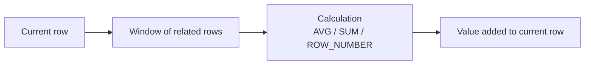
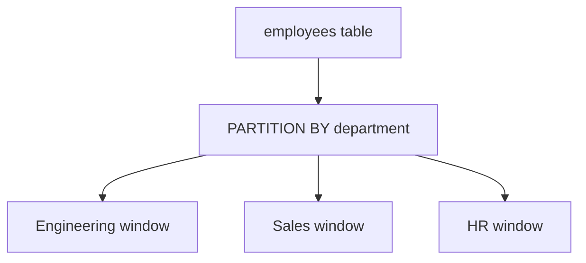
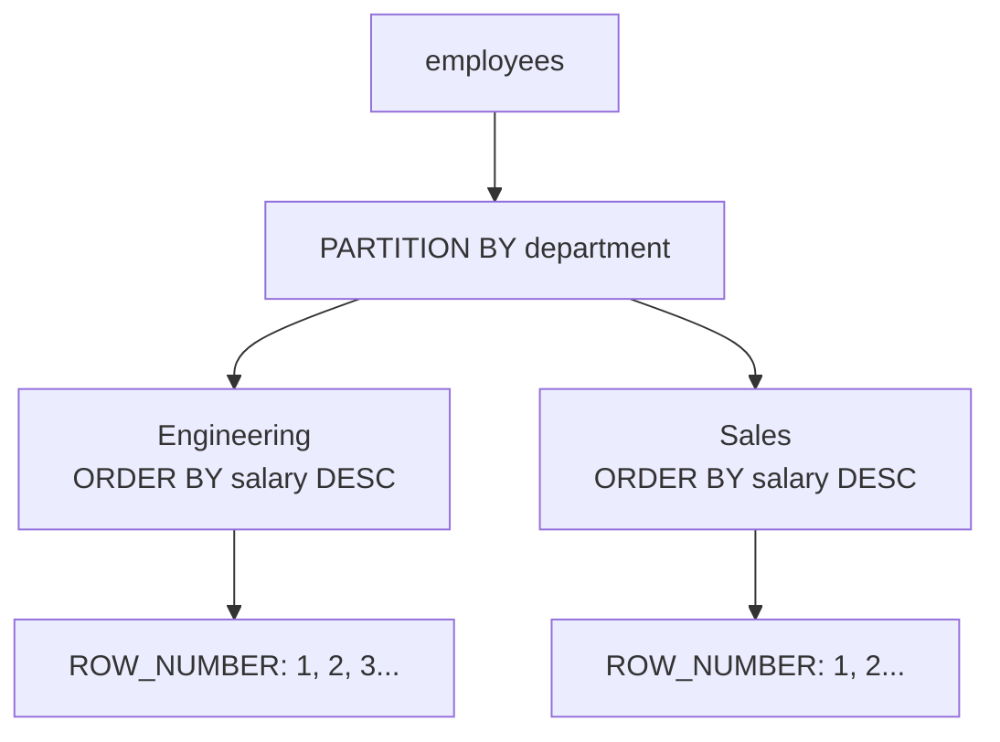
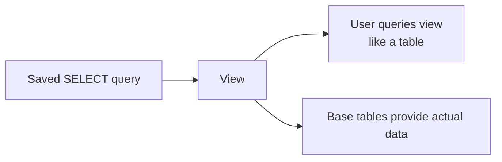

# Class 7 - Window Functions, Derived Tables & Views

> **Big picture:** `GROUP BY` summarizes rows by collapsing them. Window functions also calculate summaries, ranks, and row numbers, but they keep the original rows visible. This makes them useful when we need both row-level detail and group-level context in the same result.

---

## 1. Why Are They Called Window Functions?

A **window function** performs a calculation across a selected group of related rows called a **window**.

For each row, SQL looks through a "window" of rows connected to it, then calculates a value.



Example idea:

> For each employee, show their salary and the average salary of their department.

Normal `GROUP BY` can calculate department average, but it collapses employees into departments.

Window functions calculate the department average while preserving every employee row.

---

## 2. `GROUP BY` vs Window Functions

### `GROUP BY` Collapses Rows

```sql
SELECT department, AVG(salary) AS average_salary
FROM employees
GROUP BY department;
```

Result:

| department  | average_salary |
| ----------- | -------------: |
| Engineering |          80250 |
| Sales       |          55000 |
| HR          |          66500 |

Individual employees are no longer visible.

### Window Function Preserves Rows

```sql
SELECT
    name,
    department,
    salary,
    AVG(salary) OVER (PARTITION BY department) AS department_average_salary
FROM employees;
```

Result:

| name  | department  | salary | department_average_salary |
| ----- | ----------- | -----: | ------------------------: |
| Aarav | Engineering |  85000 |                     80250 |
| Meera | Engineering |  76000 |                     80250 |
| Kabir | Engineering |  92000 |                     80250 |
| Rohan | Engineering |  68000 |                     80250 |
| Rahul | Sales       |  52000 |                     55000 |
| Priya | Sales       |  58000 |                     55000 |

> **Key difference:** `GROUP BY` reduces many rows into one row per group. Window functions add calculated values while keeping the original rows.

---

## 3. Sample `employees` Table

The examples use this table.

| employee_id | name   | department  | city      | salary | experience_years |
| ----------: | ------ | ----------- | --------- | -----: | ---------------: |
|           1 | Aarav  | Engineering | Delhi     |  85000 |                5 |
|           2 | Meera  | Engineering | Delhi     |  76000 |                4 |
|           3 | Rahul  | Sales       | Mumbai    |  52000 |                2 |
|           4 | Nisha  | HR          | Pune      |  61000 |                6 |
|           5 | Kabir  | Engineering | Bengaluru |  92000 |                7 |
|           6 | Priya  | Sales       | Delhi     |  58000 |                3 |
|           7 | Rohan  | Engineering | Delhi     |  68000 |                2 |
|           8 | Sneha  | HR          | Mumbai    |  72000 |                5 |

---

## 4. Basic Window Function Syntax

```sql
function_name(column_name) OVER (
    PARTITION BY column_name
    ORDER BY column_name
)
```

Main parts:

| Part | Meaning |
|---|---|
| `function_name(column)` | The calculation to perform |
| `OVER (...)` | Tells SQL this is a window function |
| `PARTITION BY` | Splits rows into groups/windows |
| `ORDER BY` inside `OVER` | Defines order within each window |

Example:

```sql
SELECT
    name,
    department,
    salary,
    AVG(salary) OVER (PARTITION BY department) AS department_average_salary
FROM employees;
```

Here:

- `AVG(salary)` calculates an average.
- `OVER` makes it a window calculation.
- `PARTITION BY department` calculates separately for each department.

---

## 5. `PARTITION BY`

`PARTITION BY` divides rows into separate windows.



Example:

```sql
SELECT
    name,
    department,
    salary,
    SUM(salary) OVER (PARTITION BY department) AS department_total_salary
FROM employees;
```

This shows each employee and the total salary of that employee's department.

| name  | department  | salary | department_total_salary |
| ----- | ----------- | -----: | ----------------------: |
| Aarav | Engineering |  85000 |                  321000 |
| Meera | Engineering |  76000 |                  321000 |
| Rahul | Sales       |  52000 |                  110000 |
| Priya | Sales       |  58000 |                  110000 |

If there is no `PARTITION BY`, the whole result is treated as one window.

```sql
SELECT
    name,
    salary,
    AVG(salary) OVER () AS overall_average_salary
FROM employees;
```

---

## 6. Aggregate Window Functions

Normal aggregate functions can be used as window functions.

| Function | Meaning as a window function |
|---|---|
| `SUM()` | total over the window |
| `AVG()` | average over the window |
| `COUNT()` | count over the window |
| `MAX()` | highest value over the window |
| `MIN()` | lowest value over the window |

### 6.1 Department Average

```sql
SELECT
    name,
    department,
    salary,
    AVG(salary) OVER (PARTITION BY department) AS department_avg
FROM employees;
```

### 6.2 Department Count

```sql
SELECT
    name,
    department,
    COUNT(*) OVER (PARTITION BY department) AS employees_in_department
FROM employees;
```

### 6.3 Highest Salary in Each Department

```sql
SELECT
    name,
    department,
    salary,
    MAX(salary) OVER (PARTITION BY department) AS department_highest_salary
FROM employees;
```

This lets us compare each employee's salary with their department's highest salary.

---

## 7. Row Number Window Functions

`ROW_NUMBER()` assigns a unique sequence number to rows.

Basic syntax:

```sql
ROW_NUMBER() OVER (
    ORDER BY column_name
)
```

Example:

```sql
SELECT
    name,
    salary,
    ROW_NUMBER() OVER (ORDER BY salary DESC) AS salary_rank_number
FROM employees;
```

Result:

| name  | salary | salary_rank_number |
| ----- | -----: | -----------------: |
| Kabir |  92000 |                  1 |
| Aarav |  85000 |                  2 |
| Meera |  76000 |                  3 |

`ROW_NUMBER()` needs an `ORDER BY` inside `OVER` if the numbering should have a meaningful order.

---

## 8. Row Number Within Each Group

Use `PARTITION BY` and `ORDER BY` together.

Example:

> Number employees by salary inside each department.

```sql
SELECT
    name,
    department,
    salary,
    ROW_NUMBER() OVER (
        PARTITION BY department
        ORDER BY salary DESC
    ) AS department_salary_position
FROM employees;
```

This means:

1. Split employees by department.
2. Sort each department by salary descending.
3. Give row numbers inside each department.



This is useful for finding the top employee per department.

---

## 9. Finding Top Row Per Group

Question:

> Find the highest-paid employee in each department.

We cannot directly use a window function in `WHERE`, so we use a derived table.

```sql
SELECT name, department, salary
FROM (
    SELECT
        name,
        department,
        salary,
        ROW_NUMBER() OVER (
            PARTITION BY department
            ORDER BY salary DESC
        ) AS rn
    FROM employees
) AS ranked_employees
WHERE rn = 1;
```

How it works:

1. Inner query calculates `rn`.
2. Outer query filters to `rn = 1`.

Result:

| name  | department  | salary |
| ----- | ----------- | -----: |
| Kabir | Engineering |  92000 |
| Priya | Sales       |  58000 |
| Sneha | HR          |  72000 |

---

## 10. SQL Execution Order

SQL is written in one order, but logically evaluated in another order.

For the topics covered in class:


Class order:

| Step | Clause |
|---:|---|
| 1 | `FROM` / `JOIN` |
| 2 | `WHERE` |
| 3 | `GROUP BY` |
| 4 | `HAVING` |
| 5 | `SELECT` |
| 6 | Window functions |
| 7 | `DISTINCT` |
| 8 | `ORDER BY` |
| 9 | `LIMIT` |

This explains an important rule:

> You cannot use a window function result directly in `WHERE`, because `WHERE` runs before the window function is calculated.

Incorrect:

```sql
SELECT
    name,
    department,
    salary,
    ROW_NUMBER() OVER (
        PARTITION BY department
        ORDER BY salary DESC
    ) AS rn
FROM employees
WHERE rn = 1;
```

`rn` does not exist yet when `WHERE` runs.

Correct:

```sql
SELECT name, department, salary
FROM (
    SELECT
        name,
        department,
        salary,
        ROW_NUMBER() OVER (
            PARTITION BY department
            ORDER BY salary DESC
        ) AS rn
    FROM employees
) AS ranked_employees
WHERE rn = 1;
```

---

## 11. Derived Tables

A **derived table** is a temporary result table created inside the `FROM` clause.

It exists only for that query.

```sql
SELECT columns
FROM (
    SELECT columns
    FROM table_name
) AS derived_table_name;
```

Example:

```sql
SELECT department, average_salary
FROM (
    SELECT department, AVG(salary) AS average_salary
    FROM employees
    GROUP BY department
) AS department_averages
WHERE average_salary > 70000;
```

How it works:

1. Inner query creates a temporary table of department averages.
2. Outer query filters that temporary table.

Derived table result:

| department  | average_salary |
| ----------- | -------------: |
| Engineering |          80250 |
| Sales       |          55000 |
| HR          |          66500 |

Final result:

| department  | average_salary |
| ----------- | -------------: |
| Engineering |          80250 |

> **Key idea:** A derived table lets us query the result of another query as if it were a table.

---

## 12. Why Derived Tables Are Useful

Derived tables are useful when:

| Situation | Why derived table helps |
|---|---|
| Need to filter a calculated alias | Outer query can use the alias |
| Need to filter window function output | Window value exists in the derived table |
| Need to simplify a complex query | Breaks logic into steps |
| Need to calculate first, then query the result | Inner query becomes a temporary table |

Example:

```sql
SELECT *
FROM (
    SELECT
        name,
        salary,
        AVG(salary) OVER () AS overall_average_salary
    FROM employees
) AS salary_context
WHERE salary > overall_average_salary;
```

This finds employees earning more than the overall average while still showing the calculated average if needed.

---

## 13. Views

A **view** is a virtual table based on the result of a SQL query.

It stores the query definition, not a separate copy of the table data.



Create a view:

```sql
CREATE VIEW employee_salary_context AS
SELECT
    name,
    department,
    salary,
    AVG(salary) OVER (PARTITION BY department) AS department_average_salary
FROM employees;
```

Use the view:

```sql
SELECT *
FROM employee_salary_context;
```

To the user, the view behaves like a table.

---

## 14. Why Use Views?

Views are useful for:

| Benefit | Meaning |
|---|---|
| Reusability | Write a complex query once, use it many times |
| Simplicity | Hide joins, subqueries, or calculations behind a simple name |
| Security | Show only selected columns/rows, hide the base table |
| Consistency | Everyone uses the same saved logic |

### View as a Function-Like Idea

A view can be thought of as similar to a saved query.

It is not exactly a function because:

- it does not normally take parameters,
- it behaves like a table,
- it is based on a `SELECT` query.

But the reusable idea is similar:

> Instead of rewriting the same complex query again and again, save it as a view and query the view.

---

## 15. View vs Derived Table

| Feature | Derived table | View |
|---|---|---|
| Where defined? | Inside one query's `FROM` clause | Stored in the database |
| Lifetime | Only during that query | Stays until dropped |
| Reusable? | No | Yes |
| Name required? | Alias required for the query | Permanent view name |
| Main use | Break one query into steps | Save reusable query logic |

Derived table:

```sql
SELECT *
FROM (
    SELECT department, AVG(salary) AS average_salary
    FROM employees
    GROUP BY department
) AS department_averages;
```

View:

```sql
CREATE VIEW department_averages AS
SELECT department, AVG(salary) AS average_salary
FROM employees
GROUP BY department;

SELECT *
FROM department_averages;
```

---

## 16. Views for Security

Suppose the `employees` table contains sensitive columns:

| employee_id | name | department | salary | phone | address |
|---:|---|---|---:|---|---|

We may want some users to see only public employee information.

```sql
CREATE VIEW public_employee_info AS
SELECT
    employee_id,
    name,
    department
FROM employees;
```

Now users can query:

```sql
SELECT *
FROM public_employee_info;
```

They do not directly see `salary`, `phone`, or `address`.

> **Security idea:** Views can expose selected data while keeping base tables hidden.

---

## 17. Updatable and Non-Updatable Views

Some views can be updated. Some cannot.

### Updatable View

A view is more likely to be updatable when:

- it is based on one base table,
- it does not use grouping,
- it does not use aggregate functions,
- it includes the required base table columns.

Example:

```sql
CREATE VIEW engineering_employees AS
SELECT employee_id, name, department, salary
FROM employees
WHERE department = 'Engineering';
```

This kind of simple view may be updatable.

### Non-Updatable View

A view is usually not updatable when it uses:

- `GROUP BY`,
- aggregate functions like `AVG()` or `COUNT()`,
- joins across multiple tables,
- `DISTINCT`,
- calculated columns that do not directly exist in the base table.

Example:

```sql
CREATE VIEW department_averages AS
SELECT department, AVG(salary) AS average_salary
FROM employees
GROUP BY department;
```

This view is not naturally updatable because `average_salary` is calculated from many rows.

---

## 18. Limitations of Views

| Limitation | Explanation |
|---|---|
| Not always updatable | Complex views cannot always accept `INSERT`, `UPDATE`, or `DELETE` |
| Performance depends on query | A complex view may still run a complex query underneath |
| Does not automatically store data separately | A normal view stores query logic, not copied data |
| Can hide complexity too much | Users may forget expensive joins/calculations are happening |

> A view simplifies access, but it does not magically make a bad query fast.

---

## 19. Important Class Queries

### Query 1 - Department average beside each employee

```sql
SELECT
    name,
    department,
    salary,
    AVG(salary) OVER (PARTITION BY department) AS department_average_salary
FROM employees;
```

### Query 2 - Number employees by salary

```sql
SELECT
    name,
    salary,
    ROW_NUMBER() OVER (ORDER BY salary DESC) AS salary_position
FROM employees;
```

### Query 3 - Number employees inside each department

```sql
SELECT
    name,
    department,
    salary,
    ROW_NUMBER() OVER (
        PARTITION BY department
        ORDER BY salary DESC
    ) AS department_salary_position
FROM employees;
```

### Query 4 - Highest-paid employee per department

```sql
SELECT name, department, salary
FROM (
    SELECT
        name,
        department,
        salary,
        ROW_NUMBER() OVER (
            PARTITION BY department
            ORDER BY salary DESC
        ) AS rn
    FROM employees
) AS ranked_employees
WHERE rn = 1;
```

### Query 5 - Create and use a view

```sql
CREATE VIEW department_averages AS
SELECT department, AVG(salary) AS average_salary
FROM employees
GROUP BY department;

SELECT *
FROM department_averages;
```

---

## 20. Common Mistakes

| Mistake | Problem | Fix |
|---|---|---|
| Thinking window functions are just better `GROUP BY` | They solve different problems | Use `GROUP BY` for summary rows, window functions for row-level detail plus calculation |
| Using window function alias in `WHERE` | `WHERE` runs before window functions | Use a derived table |
| Forgetting `OVER` | Function becomes a normal aggregate | Add `OVER (...)` |
| Forgetting `PARTITION BY` | Calculation happens over the whole result | Partition by the group column |
| Assuming all views are updatable | Complex views usually are not | Check whether the view maps cleanly to one base table |

Incorrect:

```sql
SELECT
    name,
    department,
    salary,
    ROW_NUMBER() OVER (
        PARTITION BY department
        ORDER BY salary DESC
    ) AS rn
FROM employees
WHERE rn = 1;
```

Correct:

```sql
SELECT name, department, salary
FROM (
    SELECT
        name,
        department,
        salary,
        ROW_NUMBER() OVER (
            PARTITION BY department
            ORDER BY salary DESC
        ) AS rn
    FROM employees
) AS ranked_employees
WHERE rn = 1;
```

---

## 21. Mini Practice Set

Using the `employees` table, write queries for:

1. Show each employee with the overall average salary.
2. Show each employee with their department's average salary.
3. Show each employee with the total salary of their department.
4. Show each employee with the number of employees in their department.
5. Give every employee a row number ordered by salary highest to lowest.
6. Give every employee a row number within their department ordered by salary highest to lowest.
7. Find the highest-paid employee in each department.
8. Create a derived table of department average salaries and show departments above `70000`.
9. Create a view for department average salaries.
10. Create a view that exposes only employee id, name, and department.

Answers:

```sql
SELECT
    name,
    salary,
    AVG(salary) OVER () AS overall_average_salary
FROM employees;

SELECT
    name,
    department,
    salary,
    AVG(salary) OVER (PARTITION BY department) AS department_average_salary
FROM employees;

SELECT
    name,
    department,
    salary,
    SUM(salary) OVER (PARTITION BY department) AS department_total_salary
FROM employees;

SELECT
    name,
    department,
    COUNT(*) OVER (PARTITION BY department) AS employees_in_department
FROM employees;

SELECT
    name,
    salary,
    ROW_NUMBER() OVER (ORDER BY salary DESC) AS salary_position
FROM employees;

SELECT
    name,
    department,
    salary,
    ROW_NUMBER() OVER (
        PARTITION BY department
        ORDER BY salary DESC
    ) AS department_salary_position
FROM employees;

SELECT name, department, salary
FROM (
    SELECT
        name,
        department,
        salary,
        ROW_NUMBER() OVER (
            PARTITION BY department
            ORDER BY salary DESC
        ) AS rn
    FROM employees
) AS ranked_employees
WHERE rn = 1;

SELECT department, average_salary
FROM (
    SELECT department, AVG(salary) AS average_salary
    FROM employees
    GROUP BY department
) AS department_averages
WHERE average_salary > 70000;

CREATE VIEW department_averages AS
SELECT department, AVG(salary) AS average_salary
FROM employees
GROUP BY department;

CREATE VIEW public_employee_info AS
SELECT employee_id, name, department
FROM employees;
```

---

## Quick Recap - One-Liner Per Concept

- **Window function** = calculation across related rows while keeping original rows.
- **Window** = the group of rows visible to the function for the current row.
- **`OVER`** = turns an aggregate/ranking function into a window function.
- **`PARTITION BY`** = splits rows into windows.
- **`ORDER BY` inside `OVER`** = controls order within each window.
- **Aggregate window functions** = `SUM`, `AVG`, `COUNT`, `MAX`, `MIN` used with `OVER`.
- **`ROW_NUMBER()`** = gives a unique sequence number to rows.
- **Window alias in `WHERE`** = not allowed directly because of execution order.
- **Derived table** = temporary table created inside `FROM`.
- **View** = saved query that behaves like a virtual table.
- **Derived table vs view** = one-query temporary result vs reusable database object.
- **Updatable view** = simple view that can map changes back to one base table.
- **Non-updatable view** = complex view using joins, grouping, aggregates, or calculated columns.
