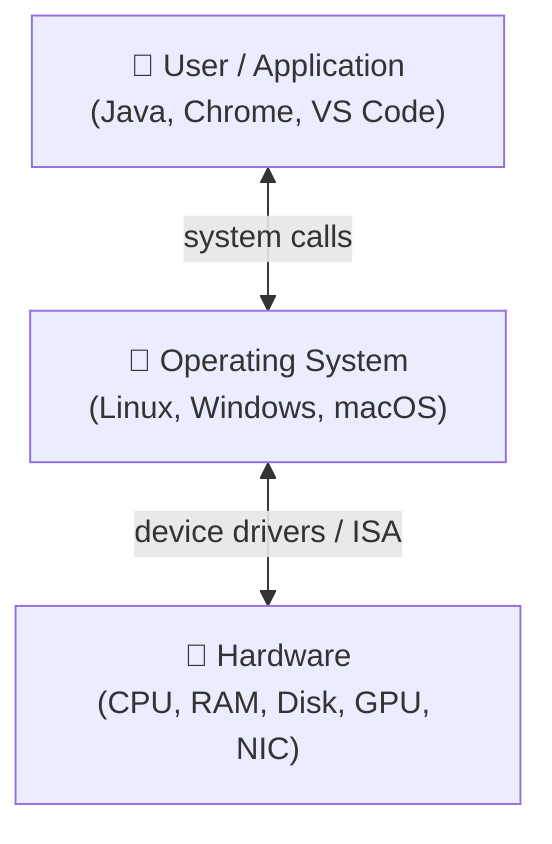
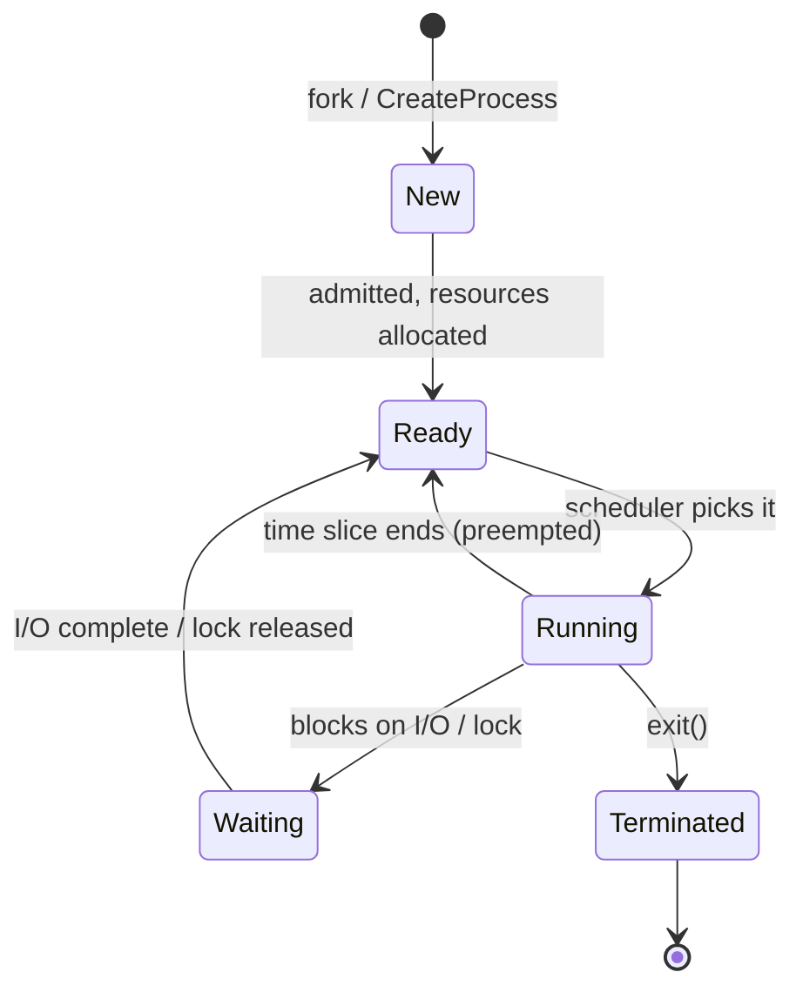
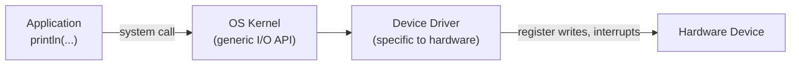
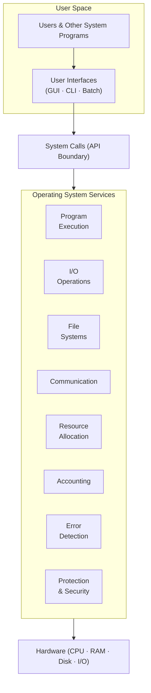
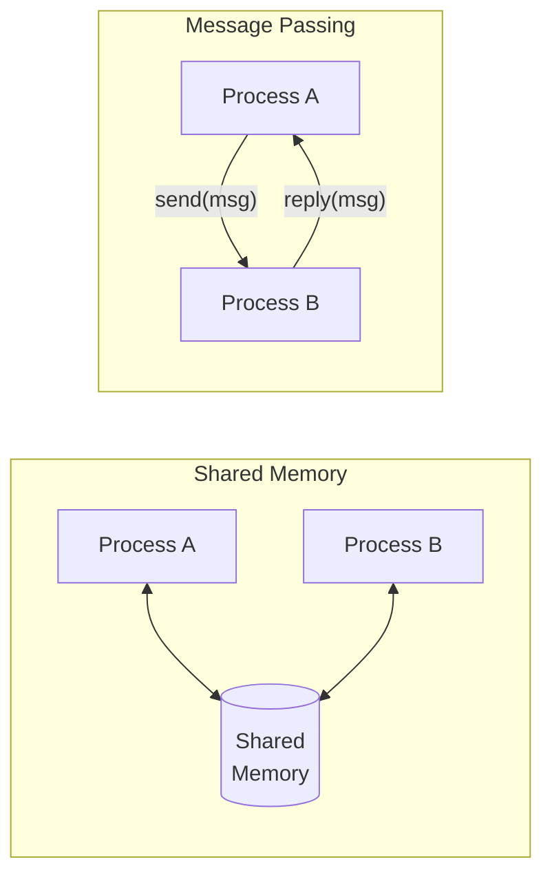
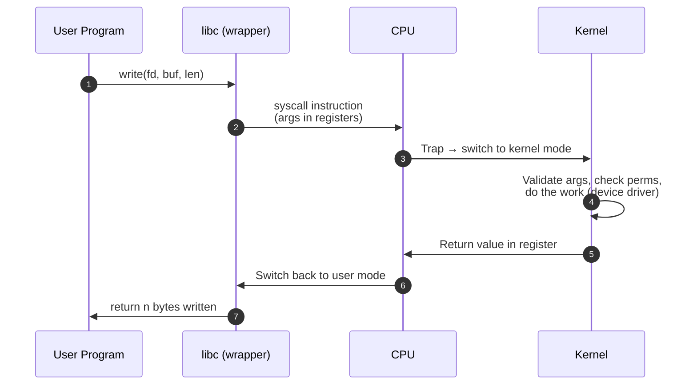

# Class 1 — Introduction to Operating Systems

> [!abstract] TL;DR
> An **Operating System (OS)** is the software layer that sits between user programs and the raw hardware. It manages memory, processes, the CPU, I/O devices, files, users, and security — and it exposes all of this to programs through a controlled interface called **system calls**. Everything else this semester (concurrency, scheduling, synchronization, deadlocks, memory management, file systems) is a *detailed look* at one of these functions.

---

## 1. The Motivating Example

![[Pasted image 20260424151410.png]]

```java
int[] arr = new int[100];
for (int i = 0; i < 100; i++) {
    System.out.println(arr[i]);
}
```

Four innocent lines of Java. But if you stop and ask *"how does this actually work inside the computer?"*, you uncover the whole OS course.

### Guiding Questions (answer these yourself as the course progresses)

> [!question] Where is this array stored?
> - The `arr` reference (8 bytes on a 64-bit JVM) lives on the **stack frame** of `main`.
> - The actual 100-int block (~400 bytes + object header) lives on the **heap**, inside the JVM's managed memory region — which the JVM itself got from the OS via a system call like `mmap`/`brk` (Linux) or `VirtualAlloc` (Windows).

> [!question] Who gives the memory for this array?
> - The **Memory Manager** subsystem of the OS.
> - The JVM asks: *"I need 400 bytes."* The OS checks its **free list / page table**, finds a free region, marks it **used**, and returns a virtual address.
> - The JVM then hands a slice of that region to your Java code as the array.

> [!question] How does `System.out.println` print to the screen?
> - Java calls into the JVM's native I/O layer.
> - The JVM issues a **system call** (`write(1, buf, len)` on Linux).
> - The OS routes the bytes to the **tty / console device driver**.
> - The device driver talks to the hardware (GPU framebuffer or terminal emulator) and pixels appear.

> [!question] How does the code run?
> 1. You run `java Main`. The OS **creates a process** for the JVM.
> 2. It allocates memory, loads the JVM binary, sets up stack + heap.
> 3. The JVM loads `Main.class`, JITs bytecode to machine code.
> 4. The OS **scheduler** gives this process CPU time slices.
> 5. The CPU executes instructions one at a time (per core); the OS preempts and resumes as needed.

Keep these four questions in mind — every function below answers a piece of them.

---

## 2. What an Operating System Is

> The OS is the **manager** between the user/program and the computer hardware.



Two jobs in one sentence:

1. **Abstraction** — hide messy hardware behind clean APIs (files, processes, sockets).
2. **Arbitration** — share finite hardware fairly and safely among many programs and users.

---

## 3. Functions of an Operating System

High-level list (each expanded below):

| #   | Function            | One-line job                                                 |
| --- | ------------------- | ------------------------------------------------------------ |
| 1   | Memory Management   | Track RAM, allocate/free, keep programs isolated             |
| 2   | Process Management  | Create, schedule, suspend, and destroy processes             |
| 3   | CPU Execution       | Share CPU time fairly across processes                       |
| 4   | Device Management   | Talk to I/O devices through drivers                          |
| 5   | File Management     | Organize persistent storage into files and directories       |
| 6   | Security            | Isolate users and programs; prevent unauthorized access      |
| 7   | System Calls        | Controlled gateway from user code into the kernel            |
| 8   | Error Detection     | Catch hardware, software, and network faults; help recover   |
| 9   | Resource Management | Account for usage; maximize utilization of limited resources |

---

### 3.1 Memory Management

> [!question] Where does `new int[100]` actually live?

The OS is responsible for every byte of RAM. When the JVM says *"I need memory for 100 ints"*:

1. The JVM calls into the OS (`malloc` → `brk`/`mmap`).
2. The OS checks its **free memory map** — a data structure tracking which physical pages are free vs. used.
3. If free memory exists → mark the region **used** and return a virtual address.
4. If not → either **swap** some cold pages to disk, or fail with out-of-memory.

```
┌──────────────────────── Process Address Space ───────────────────────┐
│                                                                      │
│  ┌──────────────┐   Stack  ← grows down, holds local vars (e.g. arr) │
│  │   stack ↓    │                                                    │
│  │              │                                                    │
│  │    (free)    │                                                    │
│  │              │                                                    │
│  │   heap ↑     │   Heap   ← grows up, holds new int[100]            │
│  ├──────────────┤                                                    │
│  │     BSS      │   Uninitialized globals                            │
│  │     Data     │   Initialized globals                              │
│  │     Text     │   Compiled code                                    │
│  └──────────────┘                                                    │
└──────────────────────────────────────────────────────────────────────┘
```

Key responsibilities:

- **Allocation & deallocation** of RAM to processes.
- **Tracking** which memory belongs to which process.
- **Isolation** — one process cannot read another's memory (enforced by the MMU + page tables).
- **Virtual memory** — every process thinks it owns all the RAM; the OS maps virtual → physical pages and swaps to disk when RAM is full.
- **Persistent memory** — also tracks what's on the **hard drive / SSD** (the file system lives on top of this).

---

### 3.2 Process Management

> [!question] How does the program run?

A **program** is a file on disk. A **process** is that program *in execution* — program + memory + CPU state + open files + accounting info.

Life cycle:



What the OS does for each process:

- **Creates** a **Process Control Block (PCB)** holding PID, state, registers, memory map, open file table.
- **Allocates resources** — memory, file descriptors, CPU time.
- **Adds it to the ready queue**.
- **Chooses** a process from the queue and puts it into the **critical section** (the CPU) to execute.
- **Preempts** when its time slice ends, **resumes** later.
- **Destroys** and reclaims resources on exit.

---

### 3.3 CPU Execution & Scheduling

The CPU executes instructions **one at a time per core** (ignoring pipelining and superscalar execution for now).

- Only one process can execute on a given core at any instant. Everyone else **waits** in a queue.
- The OS **scheduler** picks who runs next (FCFS, SJF, Round Robin, Priority, MLFQ — we'll cover these).
- The OS also ensures **fairness** — no process starves forever.
- On a multi-core machine, each core runs one process at a time, giving *true* parallelism; on a single core, the illusion of parallelism is created by fast context switching (**concurrency**).

> [!info] Concurrency vs. Parallelism (core distinction for this course)
> - **Concurrency** = dealing with many things at once (interleaving on one core).
> - **Parallelism** = doing many things at once (on multiple cores).

---

### 3.4 Device Management

> [!question] How does the output get printed?

The OS talks to every I/O device — keyboard, mouse, monitor, disk, NIC, printer — through software called **device drivers**.



- A **device driver** is hardware-specific software that knows how to speak the device's protocol.
- The OS exposes a uniform API (e.g. `read`, `write`) so apps don't care whether they're writing to a terminal, a file, or a network socket.
- When multiple monitors / devices exist, the OS **arbitrates** — decides who gets what, manages queues (e.g. print spooler).

---

### 3.5 File Management

> [!question] What does "saving a file" actually mean?

![[Pasted image 20260424114149.png]]
*A file is really just structured bytes — like rows in this table.*

Saving a file =

1. The app hands the OS a byte stream and a name.
2. The OS's **file system** (ext4, NTFS, APFS…) finds free blocks on disk.
3. It writes the bytes and records metadata: name, size, owner, timestamps, permissions, block locations.
4. It **keeps track** of the file until it's deleted.
5. When the user later asks for the file, the OS **retrieves** those blocks and reconstructs the stream.

Also:

- **Directory structure** — a tree of files for easy organization.
- **Multiple users / profiles** — each user sees their own file namespace and permissions. The OS runs different file systems or mount points per profile.
- **Access control** — who can read / write / execute each file.

---

### 3.6 Security & Protection

> [!question] Can one app access the data of another app?

**No — and enforcing that is the OS's job.**

- The OS **isolates** every process in its own virtual address space (hardware-enforced via the MMU).
- **User authentication** — passwords, tokens, biometrics gate access to the system.
- **Authorization** — access control lists (ACLs) decide who can touch which file, device, or port.
- **Protection** — kernel mode vs. user mode prevents a user program from executing privileged instructions directly.

```
┌─────────────────────────────────────────┐
│  Ring 3  (User Mode)   apps, shells     │ ← cannot touch hardware directly
├─────────────────────────────────────────┤
│  Ring 0  (Kernel Mode) the OS           │ ← full hardware access
└─────────────────────────────────────────┘
```

The transition from Ring 3 → Ring 0 happens through a **system call**.

---

### 3.7 System Calls

> We **cannot** directly communicate with the hardware from our program.

- Whenever a user program wants to do something privileged (allocate memory, read a file, send a network packet, create a process), it issues a **system call**.
- This triggers a **mode switch** from user mode to kernel mode.
- The OS performs the action on behalf of the program and switches back.

A fuller treatment is at the end of this note — this is just the entry in the "functions" list.

---

### 3.8 Error Detection & Handling

The OS is the first line of defense against every kind of error:

| Category          | Examples                                          |
|-------------------|---------------------------------------------------|
| Programming error | Divide by zero, segfault, null pointer            |
| Hardware error    | Bad sector on disk, ECC memory fault, overheating |
| Network error     | Timeout, disconnection, packet loss               |
| User error        | Invalid input, permission denied                  |

It also provides **debugging tools** — `gdb`, `strace`, `dtrace`, crash dumps, event logs.

> [!tip] Versioning / Rollback
> The OS (or the filesystem / the app) can keep copies of different versions of memory or files. If something goes wrong, the previous good version can be rolled back. Examples: filesystem snapshots (ZFS, APFS, Btrfs), System Restore, journaling filesystems.

---

### 3.9 Resource Management & Accounting

The OS keeps books on who is using what, and for how long:

- Per-process CPU time, memory usage, I/O bytes, open file handles.
- **Dependencies** — if program A depends on service B, the OS tracks that relationship (e.g. systemd).
- This accounting enables **maximum utilization** of limited resources.

> [!example] Real-world win-win
> If a cloud VM is sitting idle, its CPU / RAM can be **re-allocated** to another tenant's workload. The resource gets used, the cloud provider makes money on otherwise-wasted capacity, and the customer with a burst job gets cheaper compute. This is exactly how spot instances and overcommit work.

---

## 4. The OS as a Layered Architecture

![[Pasted image 20260424155137.png|494]]

All of the above fits together like this:



Read top-to-bottom: user → UI → system call → kernel services → hardware.

---

## 5. User Interfaces

The three classic ways a human drives an OS:

| Interface | How it works                                              | Example                                 | Good for                          |
|-----------|-----------------------------------------------------------|-----------------------------------------|-----------------------------------|
| **GUI**   | Point-and-click on graphical widgets                       | Windows Explorer, macOS Finder, GNOME   | Everyday users, discoverability   |
| **CLI**   | Type one command at a time into a shell                    | bash, zsh, PowerShell                    | Scripting, remote, power users    |
| **Batch** | Write a *file* of commands; the OS executes them together  | Shell scripts, `.bat` files, Job Control | Automation, non-interactive jobs  |

A modern OS supports all three simultaneously.

---

## 6. Types of Computing Systems

We're mostly studying the **single-machine** case, but here's the landscape:

- **Single-processor systems** — one CPU, one OS, one machine. Simplest model.
- **Multi-processor (SMP) systems** — many cores / CPUs sharing memory on *one* machine. True parallelism; the OS must synchronize.
- **Distributed systems** — many independent machines cooperating over a network (see next section).
- **Clustered systems** — tightly-coupled group of machines acting as one (HPC, database clusters).
- **Real-time systems** — strict timing guarantees (avionics, medical devices).
- **Embedded systems** — OS baked into a device (router firmware, car ECU).

---

## 7. Distributed Systems

![[Pasted image 20260424155934.png|509]]

A **distributed system** is a collection of independent computers that appears to its users as a single coherent system.

Two fundamental communication models:

### 7.1 Shared Memory
- All nodes (or threads) read/write a common memory region.
- Fast, but requires **synchronization** (locks, semaphores, barriers).
- Natural fit for multi-core within one machine; hard to fake across a network.

### 7.2 Message Passing
- Nodes exchange explicit messages over a channel (network socket, MPI, RPC, message queue).
- No shared state → fewer race conditions, but higher latency and explicit protocol design.
- Scales across machines naturally.



| Aspect          | Shared Memory                 | Message Passing                |
|-----------------|-------------------------------|--------------------------------|
| Speed           | Fast (local memory access)    | Slower (network / IPC hop)     |
| Coupling        | Tight                         | Loose                          |
| Synchronization | Required (locks, etc.)        | Built into send/receive        |
| Scales to many machines? | No (one box)         | Yes                            |
| Failure model   | All-or-nothing (one machine)  | Partial failure is normal      |

We'll return to this in the concurrency half of the course.

---

## 8. System Calls — A Closer Look

> **System calls are the bridge between the user application and the Operating System.**

### 8.1 Why they exist

User programs run in **user mode** (Ring 3) where privileged instructions are forbidden. To do anything real — open a file, allocate memory, spawn a thread — the program must ask the kernel. The system call is that controlled, checked request.

### 8.2 How one works (step-by-step)



1. App calls a library wrapper (e.g. `write()` in libc).
2. The wrapper places the **syscall number** and arguments into registers.
3. It executes a special instruction (`syscall` on x86-64, `svc` on ARM) that **traps** into the kernel.
4. The CPU switches to **kernel mode** and jumps to the kernel's syscall handler.
5. The kernel looks up the handler by number, validates arguments, performs the operation.
6. Return value is placed in a register; control returns to user mode; the wrapper returns to the app.

### 8.3 Categories of system calls

| Category             | Examples (Linux)                                   |
|----------------------|----------------------------------------------------|
| Process control      | `fork`, `exec`, `exit`, `wait`, `kill`             |
| File management      | `open`, `read`, `write`, `close`, `lseek`          |
| Device management    | `ioctl`, `read`, `write`                           |
| Information mainte.  | `getpid`, `gettimeofday`, `uname`                  |
| Communication        | `pipe`, `socket`, `send`, `recv`, `shmget`         |
| Protection           | `chmod`, `chown`, `umask`                          |

### 8.4 Why care?

Every interesting thing your program does eventually bottoms out in a system call. When we later study:

- **Concurrency** → `fork`, `clone`, `futex`
- **File systems** → `open`, `read`, `write`
- **Networking** → `socket`, `bind`, `accept`
- **Memory** → `mmap`, `brk`

…we'll be studying how the kernel implements the other side of these calls.

---

## 9. Quick Recap (flashcard-style)

- [ ] An OS is a **manager + abstractor** between programs and hardware.
- [ ] Core functions: memory, process, CPU, device, file, security, system calls, error detection, resource management.
- [ ] A **program** is static; a **process** is a running program with its own PCB.
- [ ] The CPU runs **one instruction at a time per core**; concurrency is the illusion of many programs running at once.
- [ ] All hardware access goes through **system calls** — the gate between user mode and kernel mode.
- [ ] User interfaces: **GUI, CLI, Batch**.
- [ ] Distributed systems communicate via **shared memory** or **message passing**.

---

## 10. Open Questions to Carry into Class 2

1. How exactly does the **scheduler** decide who runs next?
2. What are the concrete algorithms for **memory allocation**?
3. How do two processes cooperate safely — what is a **race condition**?
4. What happens inside the CPU during a **context switch**?
5. How does the OS recover if a **system call** fails or a process crashes?

> Continues in [[Class 2 (27th April)]] — answers questions 1 and 4 in depth, and lays the groundwork for question 3.
![[Pasted image 20260430162408.png]]