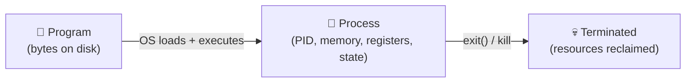
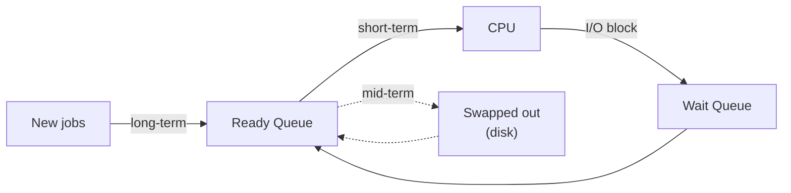
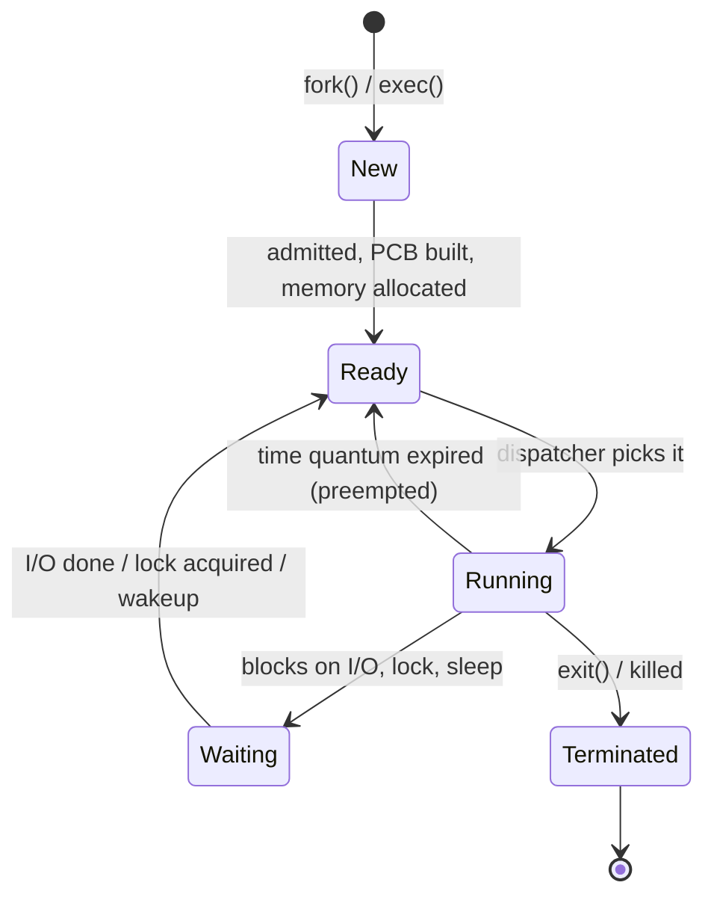
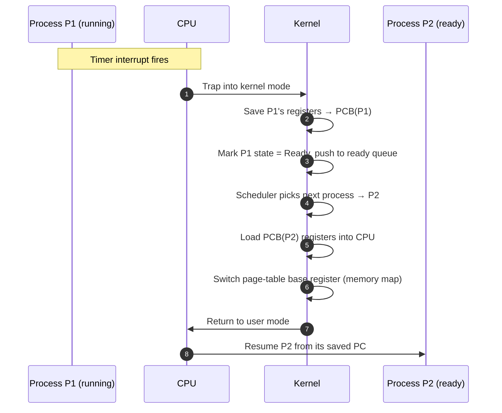
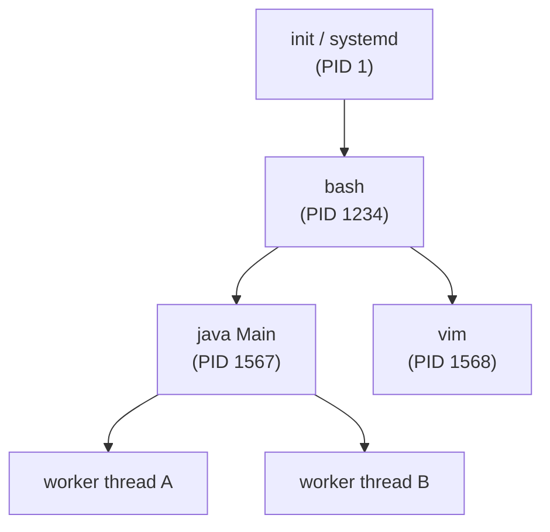

# Class 2 — Process Management, Scheduling & Context Switching

> [!abstract] TL;DR
> A **CPU core executes one instruction at a time**, yet a modern computer happily runs hundreds of programs. The trick is **process management**: the OS keeps a record (the **PCB**) of every running program, hands each one a tiny slice of CPU time, freezes its state, and swaps in the next one — thousands of times a second. The freezing-and-thawing operation is a **context switch**, and the policy that picks "who runs next" is the **scheduler**. This class formalises *what* a process is, *how* the OS represents one, *how* the CPU swaps between them, and *why* it feels seamless.

---

## 1. Recap & Motivating Questions

In [[Class 1 (24th April)]] we listed **Process Management** and **CPU Execution** as two of the nine OS functions, and ended on three open questions:

- *How exactly does the scheduler decide who runs next?*
- *What happens inside the CPU during a context switch?*
- *How do two processes cooperate safely?*

This class answers questions **1 and 2** in depth, and sets up question 3 (concurrency) for the next lecture.

> [!question] Three driving questions for today
> 1. Does your computer have a separate CPU for every running task?
> 2. How does the CPU switch between the many apps running on the system?
> 3. How does it *remember where each app got stopped* so it can resume later?

The single-sentence answer to all three: **the OS performs context-switched, time-sliced multitasking on a small number of cores, using a per-process bookkeeping structure called the PCB.** Every term in that sentence is unpacked below.

---

## 2. Program vs Process — Getting the Terminology Right

> [!warning] Common mix-up — fix this in your head now
> A **program** is the *static* thing on disk; a **process** is the *running* instance of it. The two are not interchangeable. (The earlier note "*a process is static and has no memory or CPU time*" is actually the definition of a **program** — the moment it gets memory and CPU time, it becomes a **process**:)

|                 | **Program**                            | **Process**                                  |
| --------------- | -------------------------------------- | -------------------------------------------- |
| Where it lives  | File on disk (e.g. `/usr/bin/firefox`) | RAM, with CPU registers and OS bookkeeping   |
| State           | Static bytes                           | Dynamic — has a state, registers, open files |
| Count           | One copy of `firefox` on disk          | Many `firefox` processes can run from it     |
| Identity        | A path                                 | A PID (process ID)                           |
| Owns resources? | No                                     | Yes — memory, file descriptors, CPU time     |



A useful analogy: a **recipe** in a cookbook is a program; **you actually cooking it in your kitchen** is a process. Two friends cooking the same recipe in two kitchens are two processes from the same program.

> See also: [[Class 1 (24th April)#3.2 Process Management]] — first introduction to PCB and the ready queue.

![[Pasted image 20260427152524.png]]

---

## 3. CPU Anatomy — The Hardware Behind Scheduling

To understand *why* scheduling is needed at all, look at what a CPU actually is.

![[Pasted image 20260427152745.png]]

A single **core** is the smallest unit that can independently execute instructions. Every core contains:

| Component                         | Job                                                                                                    |
| --------------------------------- | ------------------------------------------------------------------------------------------------------ |
| **ALU** (Arithmetic & Logic Unit) | Does the math and boolean ops                                                                          |
| **Registers**                     | Tiny, ultra-fast storage cells holding the *current* operands, results, program counter, stack pointer |
| **Control Unit (CU)**             | Decodes instructions and orchestrates the ALU + registers                                              |
| **L1 / L2 cache**                 | Very fast on-die memory holding recently-used data                                                     |
| **Bus interface**                 | Carries data between this core and the rest of the chip / RAM                                          |

> [!note] Refinement
> ALU + registers alone are not a complete core — the **control unit** is what makes a core *autonomous*. Without it, the registers and ALU are just connected silicon with no one telling them what to do. Always picture a core as **CU + ALU + registers + cache**.

![[Pasted image 20260427152915.png]]
![[Pasted image 20260427152928.png]]

### 3.1 Multi-core and SMT

- **Multi-core** = multiple complete cores on the same chip → genuine **parallelism** (one core per process at a given instant).
- **Hyper-Threading / SMT** (Simultaneous Multi-Threading) = each physical core pretends to be 2 logical cores by duplicating the register file but sharing the ALU. Linux/Windows see "8 CPUs" on a 4-core SMT chip — but only 4 things truly run in parallel; the rest is fast switching.
- **Single-core** = no parallelism at all; everything is **concurrent** (the OS interleaves).

> Concurrency vs parallelism — see [[Class 1 (24th April)#3.3 CPU Execution & Scheduling]].

> [!info] Why this matters for scheduling
> Even a 16-core CPU is finite. A laptop typically has hundreds of processes (`ps -e | wc -l` to check). The OS must share the cores fairly — that is the **scheduler's** job.

---

## 4. CPU Scheduling

> [!definition]
> **CPU scheduling** is the OS's policy for picking *which* process from the **ready queue** runs next on a CPU core, and for *how long*.

### 4.1 Why scheduling exists (goals)

| Goal | What it means |
|---|---|
| **High utilization** | Keep the CPU busy — idle CPU is wasted hardware |
| **High throughput** | Maximise processes completed per unit time |
| **Low turnaround time** | From submit → finish, keep it short |
| **Low waiting time** | Time a process sits in the ready queue |
| **Low response time** | Time from request → first response (matters for UI) |
| **Fairness** | No process starves forever |

These goals **conflict** — minimising waiting time can hurt fairness, and maximising throughput can hurt response time. Different schedulers pick different trade-offs.

### 4.2 Three levels of scheduler



- **Long-term scheduler** — decides which jobs are admitted into the system at all (rare on desktop OSes, common on batch / mainframe systems).
- **Short-term scheduler (dispatcher)** — picks the next process from the ready queue *every few milliseconds*. This is what people usually mean by "the scheduler".
- **Mid-term scheduler** — swaps idle processes out to disk when RAM is tight, swaps them back when there's room. (Also called "swapper".)

### 4.3 Scheduling policies — preview

| Policy | One-line idea |
|---|---|
| **FCFS** (First Come First Served) | Whoever arrived first runs to completion. Simple but slow on long jobs. |
| **SJF** (Shortest Job First) | Pick the process with the smallest expected burst. Optimal average waiting time, but needs to *know* burst length and can starve long jobs. |
| **Priority** | Each process has a priority number; highest priority runs. Risk: low-priority starvation → fixed by **aging**. |
| **Round Robin (RR)** | Every process gets a fixed **time quantum**, then is preempted. Fair, great for time-sharing. |
| **MLFQ** (Multi-Level Feedback Queue) | Multiple queues with different quanta; processes move between queues based on behaviour. What real OSes (Linux CFS, Windows) use, in spirit. |

> We will dissect each in Class 3.

---

## 5. Preemptive vs Non-Preemptive Scheduling

> [!question] Can a process keep running forever once it starts?
> **It depends on the scheduler.**

| | **Non-preemptive** | **Preemptive** |
|---|---|---|
| Who decides to give up CPU | The process itself (when it finishes or blocks) | The OS, via timer interrupt |
| Can a long process block others? | Yes | No |
| Examples | FCFS, non-preemptive SJF | RR, preemptive SJF, MLFQ, modern OSes |
| Pros | Simple, low overhead | Fair, responsive, fault-tolerant |
| Cons | One badly-behaved process freezes the system | Context-switch overhead |

In a **non-preemptive** world, a 70-second compute job would indeed block everything else for 70 seconds. Modern desktop and server OSes are **preemptive**, so the answer to *"will subsequent processes wait 70 seconds?"* is **no — the OS forcibly takes the CPU back after a few milliseconds and gives the next process a turn.**

### 5.1 Time slice (a.k.a. time quantum)

> The CPU gives each process a small time window. When the window ends, the OS **preempts** the process — even mid-instruction-stream — and lets the next one run.

- Linux's default scheduling latency target is around **6–24 ms** per task on a typical desktop.
- A hardware **timer interrupt** fires every few milliseconds; that's the OS's heartbeat for preemption.

> [!info] The quantum trade-off
> - **Too small** → too many context switches → most CPU time is spent *switching* instead of *working* (see §7.4).
> - **Too large** → poor responsiveness, the system feels sluggish.
> - Real schedulers tune this dynamically per workload.

![[Pasted image 20260427154359.png]]
![[Pasted image 20260427154403.png]]

Walk-through of the diagram: P1 runs 5 s → preempted → P2 runs to completion → P3 runs to completion → P4 runs 5 s → preempted → P1 resumes from where it left off → P4 finishes. Notice that **P1 picks up from exactly where it stopped**, not from the start. That "remembering" is the entire point of context switching, covered in §7.

---

## 6. Process States — The Full Life Cycle

Processes are **not always running**. They move through a small set of states, driven by scheduling and I/O events.

> [!warning] Don't omit *Waiting*
> A first sketch of states is `New → Ready → Running → Terminated`. That misses the most common state of all: **Waiting (a.k.a. Blocked)** — when a process is paused waiting for I/O (disk read, network packet, keyboard) or a lock. Most processes spend the majority of their life in **Waiting**, not Running.



| State | Meaning |
|---|---|
| **New** | Being created — PCB allocated, memory being set up. |
| **Ready** | Has everything it needs *except* the CPU. Sitting in the ready queue. |
| **Running** | Currently executing on a core. **At most one process per core in this state.** |
| **Waiting / Blocked** | Cannot make progress until an external event (disk read, mutex, sleep timer). Not in the ready queue. |
| **Terminated / Zombie** | Finished executing. Resources mostly freed; PCB lingers briefly so the parent can read its exit code. |

![[Pasted image 20260427155242.png]]

> [!example] Why Waiting matters
> When you click a button in your IDE, the IDE process goes from **Running → Waiting** for the disk read to return. While it waits, the OS schedules **other** processes onto the CPU. If the OS *didn't* have a Waiting state and instead kept the IDE in Ready, it would be picked, immediately re-block, and waste a context switch. The Waiting state is what enables **I/O concurrency**.

---

## 7. Context Switching

> [!question] When the CPU switches from process A to process B, what does it have to remember about A?

Everything needed to resume A *exactly where it left off*: the ongoing computation, the call stack, the open files. Collectively this is the **context** of a process.

### 7.1 What "the context" actually contains

| Saved | Why |
|---|---|
| **Program counter (PC)** | The next instruction to execute |
| **CPU registers** (general-purpose, flags, stack pointer, base pointer) | The in-flight computation |
| **Process state** | Running / Ready / Waiting |
| **Memory map** (page table base register) | So the MMU sees the right virtual → physical mapping |
| **Open file descriptors** | Files / sockets the process has open |
| **Accounting info** (CPU time used, PID, parent PID, priority) | Bookkeeping |
| **Scheduling info** (priority, queue pointer) | For the next dispatch decision |

This whole bundle is the **Process Control Block (PCB)** — one PCB per process.

![[Pasted image 20260427160021.png]]

Analogy from class: solving a list of DSA problems. You hit a hard one, **flag it** with everything you'd tried so far ("here's my partial solution, the variables I'd named, where I was stuck") and move on. The flag *is* the context. When you come back, you don't restart from the problem statement — you restart from the flag.

![[Pasted image 20260427160600.png]]

### 7.2 Where does the PCB live?

> [!answer] Not in registers — in **kernel memory**.
> Registers belong to a *single core*; there are only a few dozen of them. The OS maintains a **process table** (an array / linked list of PCBs) in the part of RAM only the kernel can touch. When a process is **Running**, *its* PCB's register fields are essentially "loaded into" the actual CPU registers. The moment it stops running, the kernel copies the live registers back into the PCB and the next process's PCB is copied in.

```
            Kernel memory (Ring 0 — see Class 1 §3.6)
       ┌─────────────────────────────────────────────┐
       │  Process Table                              │
       │  ┌────────┐ ┌────────┐ ┌────────┐ ┌───────┐ │
       │  │ PCB P1 │ │ PCB P2 │ │ PCB P3 │ │  ...  │ │
       │  └────────┘ └────────┘ └────────┘ └───────┘ │
       └─────────────────────────────────────────────┘
              ↑                ↑
              │ copy out       │ copy in
              │                │
       ┌─────────────────────────────┐
       │   CPU Core (live registers) │
       └─────────────────────────────┘
```

User processes **cannot** read or write the process table directly — that's the kernel-mode protection from [[Class 1 (24th April)#3.6 Security & Protection]]. Every context switch requires a **mode switch** into kernel mode via an interrupt.

### 7.3 Step-by-step of one context switch



### 7.4 Overhead — why context switches aren't free

A single switch is fast (≈ 1–10 µs), but at **thousands per second** the cost adds up. Sources of overhead:

- **Pure work** to copy registers in/out of the PCB.
- **Cache pollution** — P2's working set isn't in the L1/L2 cache yet; the next hundred instructions miss cache and stall on RAM.
- **TLB flush** — the Translation Lookaside Buffer (the MMU's page-table cache) usually has to be invalidated on a memory-map change. Subsequent loads pay full page-walk cost.
- **Pipeline flush** — modern CPUs are deeply pipelined; switching tears down the pipeline.
- **Kernel-mode entry/exit** itself costs cycles.

> [!info] Why the time-quantum trade-off bites
> If the quantum is 10 µs and a switch costs 5 µs, you spend **a third** of the CPU on switching. If the quantum is 10 ms, switch overhead is < 0.1%. Real schedulers pick a quantum well above the switch cost.

---

## 8. Multitasking

**Multitasking** = the OS gives the *illusion* that many processes run at once. We've now seen the machinery (preemption + context switching + scheduling); this section names the patterns.

### 8.1 Cooperative vs preemptive multitasking

| | **Cooperative** | **Preemptive** |
|---|---|---|
| Who yields the CPU | The process itself (must call `yield()`) | The OS via timer interrupt |
| Misbehaving process | Hangs the whole system | Gets preempted, system stays alive |
| Historical examples | Classic Mac OS (≤ 9), Windows 3.x | Linux, modern Windows, macOS, iOS, Android |

Cooperative multitasking is mostly extinct on general-purpose OSes — one bug in one app would freeze your whole machine. It still appears in **userspace coroutines** (Python `asyncio`, Go goroutines yielding at I/O points, JavaScript event loop), where the runtime — not the OS — does the scheduling.

### 8.2 Process-based vs thread-based

- **Process-based** multitasking → switching between *different programs* (Chrome ↔ VS Code).
- **Thread-based** multitasking → switching between *threads inside one process* (Chrome's UI thread ↔ Chrome's network thread).

Threads share memory; processes don't. Threads are cheaper to switch (no page-table change → no TLB flush). Concurrency mostly means thread-level — covered in detail later this term.

### 8.3 Parent and child processes

Every process (except the very first one — `init` / `systemd`, **PID 1**) is created by another process via `fork()` (Unix) or `CreateProcess()` (Windows). The creator is the **parent**; the new one is the **child**.



![[Pasted image 20260427161926.png]]

#### How `fork()` works (Unix)

1. Parent calls `fork()`.
2. The OS **clones the parent's PCB** → new PID, almost-identical memory image (copy-on-write), same open files.
3. Both parent and child return from `fork()`. The return value is **0 in the child** and the **child's PID in the parent** — that's how each tells which one it is.
4. Either side can then `exec()` to load a different program into the child, or just keep running the same code on different data.

```c
pid_t pid = fork();
if (pid == 0) {
    // child
    exec("/bin/ls", ...);   // optional: replace with another program
} else {
    // parent
    wait(NULL);             // optionally wait for the child to finish
}
```

#### Useful related calls

| Call | Effect |
|---|---|
| `fork()` | Create a child clone of the current process |
| `exec()` family | Replace the current process's program with a new one |
| `wait()` / `waitpid()` | Parent blocks until child finishes; reads exit code |
| `exit()` | Terminate the calling process |
| `kill(pid, sig)` | Send a signal (SIGTERM, SIGKILL, …) |

#### Edge cases — zombies and orphans

- **Zombie** — child has `exit()`-ed but parent hasn't called `wait()` yet. PCB lingers until the parent reaps it. Many zombies = a buggy parent.
- **Orphan** — parent died first. The child is **re-parented** to PID 1, which calls `wait()` for it eventually so it doesn't leak.

> [!example] Run `ps -ef --forest` on Linux to literally see this tree.

---

## 9. Quick Recap (flashcard-style)

- [ ] A **program** is static (on disk); a **process** is the program *in execution* with memory + CPU + state.
- [ ] A **core** = ALU + registers + control unit + cache. More cores = more *parallelism*.
- [ ] The **scheduler** picks who runs next from the **ready queue**; the **dispatcher** actually swaps them in.
- [ ] **Preemptive** schedulers can take the CPU back via a **timer interrupt**; non-preemptive cannot.
- [ ] A **time quantum** is the slice of CPU each process gets in Round Robin / preemptive scheduling.
- [ ] Process states: **New → Ready → Running ↔ Waiting → Terminated** (don't forget Waiting).
- [ ] A **context switch** saves the running process's registers + PC + memory map into its **PCB** and loads the next process's PCB.
- [ ] The **PCB** lives in **kernel memory**, not in registers.
- [ ] Context-switch overhead = register copy + cache pollution + TLB flush + pipeline flush.
- [ ] **`fork()`** returns 0 in the child and the child's PID in the parent — that's the only way each process knows who it is.
- [ ] **PID 1** (`init` / `systemd`) is the ancestor of every process and the adoptive parent of orphans.

---

## 10. Open Questions to Carry into Class 3

1. Now that we know *what* a context switch is, **what are the actual algorithms** the scheduler uses to pick from the ready queue? (FCFS, SJF, RR, Priority, MLFQ — quantitative comparison.)
2. How is **fairness** defined formally, and how do schedulers like Linux's CFS approximate it?
3. What changes when we have **threads** instead of processes — what is shared, and what isn't?
4. When two processes / threads share memory, what can go wrong? (→ race conditions, the start of the concurrency unit.)
5. How does an `exec()` actually replace a running program in place — what survives, what is wiped?

> Continues from [[Class 1 (24th April)#10. Open Questions to Carry into Class 2|Class 1's open questions]]; questions 1, 3, 4 from there are now partially answered above.
